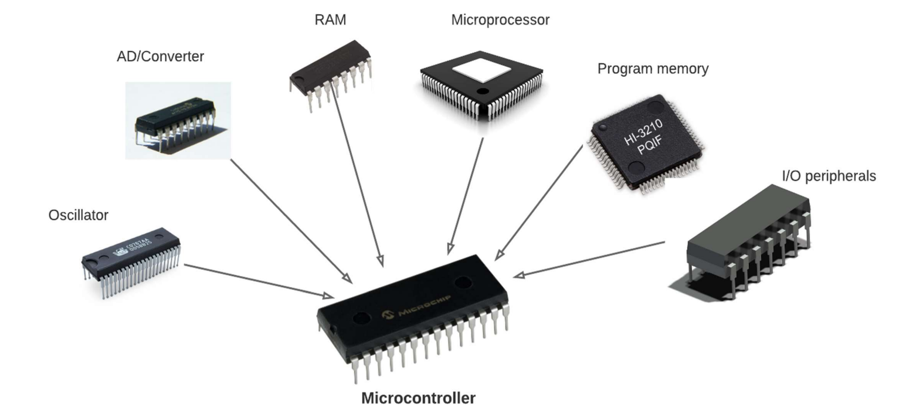
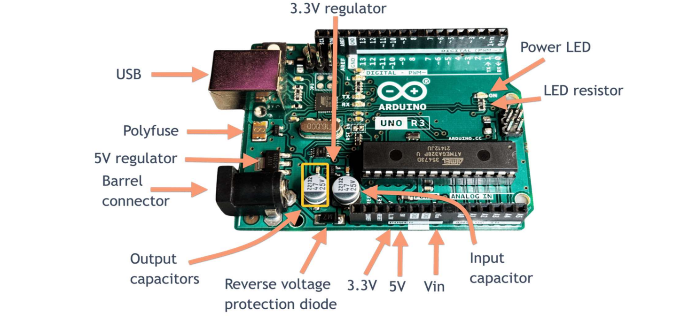
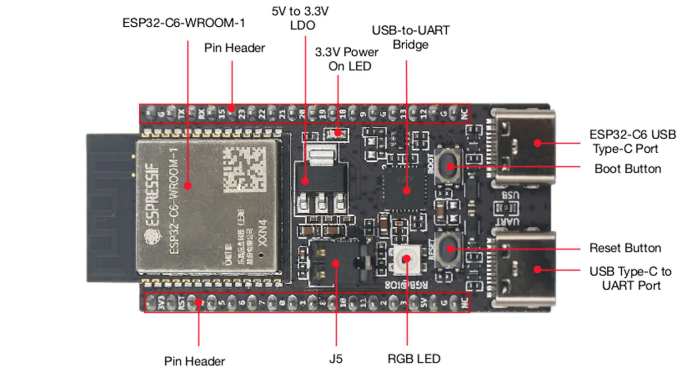
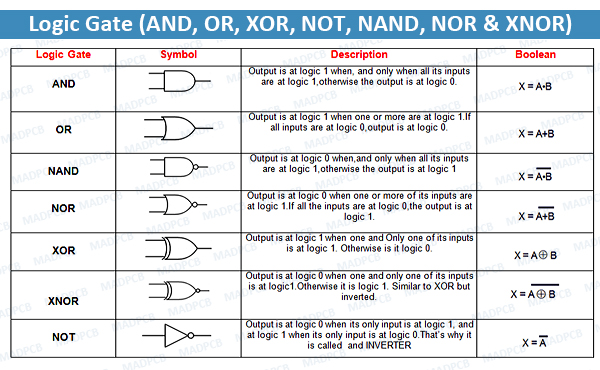
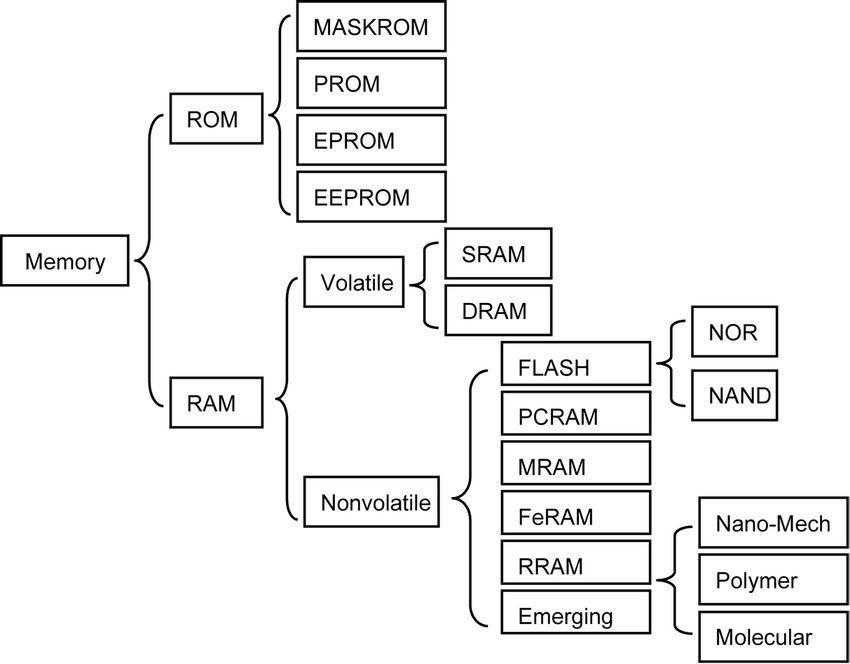
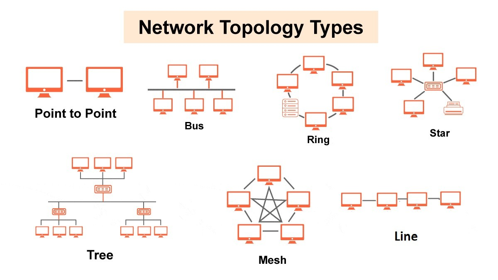
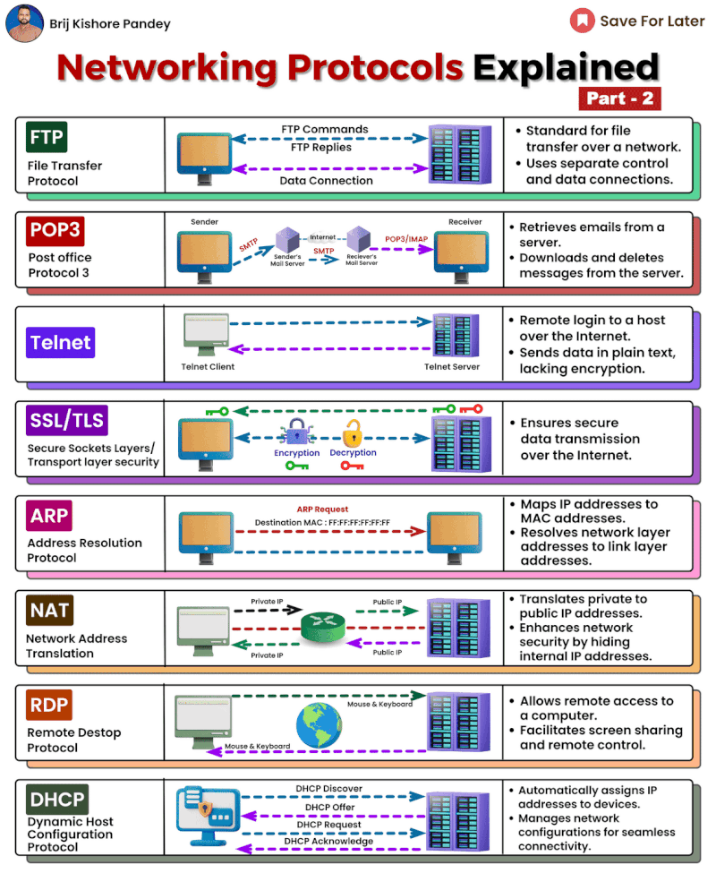
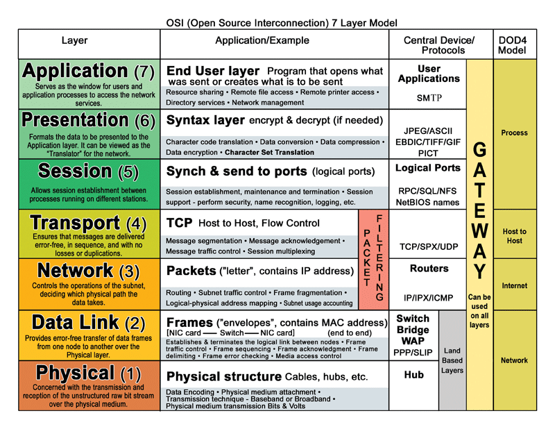

# Hardware Design & Quality Metrics

## **Summary of Lecture 1: Hardware Design & Quality Metrics**

#### **Introduction & Foundations**

In this lecture, we focused on the foundational concepts of hardware design and quality metrics. We started by exploring the importance of clearly defining project requirements, which are essential for guiding the hardware design process. This also included an introduction to embedded systems, their core components, and a review of number systems and digital logic.

#### **Key Learning Outcomes**

By the end of this lecture, you should be able to:

1. Understand the course structure and requirements (assignments, projects, exams).
2. Define clear project requirements:
   * **Functional Requirements** : What the system must do (e.g., "The device must measure temperature and humidity").
   * **Performance Requirements** : How well the system must perform (e.g., "The temperature sensor must have an accuracy of +/- 0.2 degrees Celsius").
   * **Constraints** : Limitations on design (e.g., "The device must operate on a coin-cell battery for at least 2 years").
3. Understand the key characteristics of embedded systems (e.g., specific task, real-time operation).
4. Identify and work with binary and hexadecimal number systems.
5. Understand basic logic gates (AND, OR, NOT, XOR, NAND, NOR) and how they form digital circuits.

### **1. Defining Project Requirements**

* **Why Requirements Matter** : Requirements guide the entire project, acting as a blueprint. Without them, projects can face rework, delays, cost overruns, and customer dissatisfaction.

#### **Types of Requirements** :

* **Functional Requirements** : These define the system's capabilities (e.g., "The device must communicate with a smartphone via Bluetooth").
* **Performance Requirements** : These specify how well the system should perform (e.g., "The system must sample every 5 seconds").
* **Constraints** : These limit the design in aspects such as cost, size, power, and environment (e.g., "The device must fit within a 10 cm x 10 cm x 5 cm enclosure").
* **Requirement Gathering Techniques** : Methods like brainstorming, user interviews, surveys, and studying existing systems help gather the right requirements.
* **Documenting Requirements** : Requirements should be clearly documented for future reference. Techniques include using formal requirement specifications, user stories, and use case diagrams.

### **2. Introduction to Embedded Systems**

**What is an Embedded System?**

  * An embedded system is a dedicated computer designed to perform a specific task. Unlike general-purpose computers, embedded systems are optimized for a single purpose, often with strict performance constraints.
  * **Examples** : Embedded systems can be found in devices like microwaves, fitness trackers, pacemakers, and automobile systems (e.g., airbag control).

#### **Key Characteristics of Embedded Systems** :

* **Dedicated Function** : Each embedded system is designed for a specific task (e.g., controlling the cooking process in a microwave).
* **Real-Time Operation** : Systems that require real-time responsiveness (e.g., car airbags deploying during a collision).
* **Constraints** : Often have limited resources, such as processing power and memory (e.g., a fitness tracker with long battery life).

#### **Core Components** :

* **Microcontroller** : The "brain" of the system, containing the:
   
    - processor:- Executes the instructions of theembedded software. 
    - memory (RAM/ROM):- RAM stores data and program variables duringexecution. ROM stores the embedded software program.
    - Peripherals :- On-chip components that provide specific functions, such as timers, analog-to-digital converters(ADCs), and communication interfaces.
* **Peripherals** : External components like 
    - sensors (to gather environmental data) 
    - actuators (to control physical devices)
    - communication modules (for device communication via Wi-Fi, Bluetooth, etc.).

#### **Examples of Microcontrollers** :

* **Arduino** : Popular for educational and hobbyist use.


* **ESP32** : A microcontroller with built-in Wi-Fi and Bluetooth, ideal for IoT applications.


* **STM32** : A family of powerful microcontrollers suitable for more complex applications.
* **Applications** : Embedded systems are used in a variety of industries, including consumer electronics, automotive, industrial automation, medical devices, and aerospace.

#### **Illustrative Example** :

* A **smart thermostat** can have an embedded system with:
  * **Microcontroller** : To process sensor data and control the HVAC system.
  * **Peripherals** :
  * **Temperature sensor** : Measures room temperature.
  * **Wi-Fi module** : Allows remote control via the internet.
  * **Display** : Shows the current temperature and settings.

### **3. Number Systems & Digital Logic Fundamentals**

### **Number Systems & Digital Logic Fundamentals**

#### **1. Number Systems**

Number systems are essential in digital electronics and computer systems. They provide a way of representing and manipulating data in a form that can be processed by machines. Let's explore the primary number systems used in digital systems:

##### **1.1 Binary Number System**

The **binary number system** is the foundation of all digital systems because it uses only two digits: 0 and 1, which represent the two voltage levels (low and high) in digital circuits.

**Example**: Convert the decimal number **10** to binary.

1. Divide 10 by 2, noting the quotient and the remainder:
   - \( 10 \div 2 = 5 \) remainder 0
   - \( 5 \div 2 = 2 \) remainder 1
   - \( 2 \div 2 = 1 \) remainder 0
   - \( 1 \div 2 = 0 \) remainder 1
2. Read the remainders from bottom to top to get the binary number: **1010**.

Thus, the decimal number 10 is equivalent to **1010** in binary.

##### **1.2 Hexadecimal Number System**

The **hexadecimal number system** is a base-16 system that is commonly used to represent binary numbers in a more compact and human-readable format. Each hexadecimal digit represents four binary digits (bits).

**Hexadecimal Digits**: 0-9 and A-F (where A = 10, B = 11, ..., F = 15).

**Example**: Convert the binary number **11111010** to hexadecimal.

1. Group the binary number into groups of four bits (from right to left):
   - 1111 1010
2. Convert each group to hexadecimal:
   - 1111 = **F** (15 in decimal)
   - 1010 = **A** (10 in decimal)
3. Combine the hexadecimal digits: **FA**.

Thus, the binary number **11111010** is equivalent to **FA** in hexadecimal.

##### **1.3 Conversions Between Number Systems**

1. **Binary to Decimal**: Sum the powers of 2 for each bit that is set to 1.
   - Example: Convert **1010** to decimal:
     - \( 1 \times 2^3 + 0 \times 2^2 + 1 \times 2^1 + 0 \times 2^0 = 8 + 0 + 2 + 0 = 10 \)

2. **Decimal to Binary**: Use successive division by 2.
   - Example: Convert decimal **25** to binary:
     - \( 25 \div 2 = 12 \) remainder 1
     - \( 12 \div 2 = 6 \) remainder 0
     - \( 6 \div 2 = 3 \) remainder 0
     - \( 3 \div 2 = 1 \) remainder 1
     - \( 1 \div 2 = 0 \) remainder 1
     - Reading the remainders from bottom to top gives **11001**.

3. **Binary to Hexadecimal**: Group the binary number into sets of four bits, then convert each group to hexadecimal.
   - Example: Convert binary **11001101** to hexadecimal:
     - Group into 4 bits: 1100 1101
     - Convert each group:
       - 1100 = **C**
       - 1101 = **D**
     - Result: **CD**

4. **Hexadecimal to Binary**: Convert each hexadecimal digit to its 4-bit binary equivalent.
   - Example: Convert hexadecimal **A3** to binary:
     - A = **1010**
     - 3 = **0011**
     - Result: **10100011**

#### **2. Digital Logic Gates**

Digital logic gates are the basic building blocks of digital circuits. They perform logical operations on binary inputs and produce a binary output based on predefined rules.

##### **2.1 AND Gate**



- **Function**: The AND gate outputs 1 only if **all** its inputs are 1; otherwise, it outputs 0.
  
**Truth Table**:

| Input A | Input B | Output (A AND B) |
|---------|---------|------------------|
|    0    |    0    |        0         |
|    0    |    1    |        0         |
|    1    |    0    |        0         |
|    1    |    1    |        1         |

##### **2.2 OR Gate**

- **Function**: The OR gate outputs 1 if **any** of its inputs is 1; it only outputs 0 when all inputs are 0.
  
**Truth Table**:

| Input A | Input B | Output (A OR B) |
|---------|---------|-----------------|
|    0    |    0    |        0        |
|    0    |    1    |        1        |
|    1    |    0    |        1        |
|    1    |    1    |        1        |

##### **2.3 NOT Gate**

- **Function**: The NOT gate inverts the input; if the input is 1, the output will be 0, and vice versa.
  
**Truth Table**:

| Input | Output (NOT A) |
|-------|----------------|
|   0   |       1        |
|   1   |       0        |

##### **2.4 XOR Gate**

- **Function**: The XOR (exclusive OR) gate outputs 1 if the inputs are **different**; otherwise, it outputs 0.

**Truth Table**:

| Input A | Input B | Output (A XOR B) |
|---------|---------|------------------|
|    0    |    0    |        0         |
|    0    |    1    |        1         |
|    1    |    0    |        1         |
|    1    |    1    |        0         |

##### **2.5 NAND Gate**

- **Function**: The NAND gate is the opposite of the AND gate. It outputs 0 only when both inputs are 1, and outputs 1 in all other cases.

**Truth Table**:

| Input A | Input B | Output (A NAND B) |
|---------|---------|-------------------|
|    0    |    0    |         1         |
|    0    |    1    |         1         |
|    1    |    0    |         1         |
|    1    |    1    |         0         |

##### **2.6 NOR Gate**

- **Function**: The NOR gate is the opposite of the OR gate. It outputs 1 only when both inputs are 0, and outputs 0 in all other cases.

**Truth Table**:

| Input A | Input B | Output (A NOR B) |
|---------|---------|------------------|
|    0    |    0    |        1         |
|    0    |    1    |        0         |
|    1    |    0    |        0         |
|    1    |    1    |        0         |

#### **3. Boolean Algebra**

Boolean algebra is a mathematical structure used for manipulating logical expressions and simplifying logic circuits. It uses three main operators: AND, OR, and NOT, and follows several fundamental laws.

##### **3.1 Basic Boolean Operators**

1. **AND** (\( A \cdot B \)) – True if both A and B are true.
2. **OR** (\( A + B \)) – True if either A or B is true.
3. **NOT** (\( \overline{A} \)) – Inverts the value of A.

##### **3.2 Boolean Laws**

1. **Identity Law**:
   - \( A \cdot 1 = A \)
   - \( A + 0 = A \)
2. **Null Law**:
   - \( A \cdot 0 = 0 \)
   - \( A + 1 = 1 \)
3. **Complement Law**:
   - \( A \cdot \overline{A} = 0 \)
   - \( A + \overline{A} = 1 \)
4. **De Morgan's Theorem**:
   - \( \overline{A \cdot B} = \overline{A} + \overline{B} \)
   - \( \overline{A + B} = \overline{A} \cdot \overline{B} \)

#### **Example of Simplifying Logic Expressions**:

Simplify the expression \( A \cdot (A + B) \).

- Apply the **Absorption Law**: \( A \cdot (A + B) = A \)

This is a simplified Boolean expression.

### **Conclusion**

Understanding number systems and digital logic gates is essential for designing digital circuits and embedded systems. Binary and hexadecimal number systems are used to represent and manipulate data, while logic gates allow for the creation of complex decision-making circuits that form the foundation of all digital devices. Boolean algebra helps simplify and optimize these circuits for real-world applications.

## **Lecture 2: Computer Architecture Summary**

**Overview:**
Computer architecture is the study of designing and interconnecting hardware components to build efficient computing systems that meet specific performance, functionality, and cost goals. This lecture covers processor architectures, memory technologies, input/output systems, and network fundamentals.

---

### **Processor Architectures:**

- **CPUs (Central Processing Units)**  
  The brains of a computer, performing calculations, executing instructions, and managing other components.

- **Instruction Set Architecture (ISA)**  
  ISA defines the operations a CPU can perform and acts as the interface between the hardware and software. It allows the software to control the hardware directly.

#### **Instruction Types:**

- **Arithmetic/Logical Instructions:** These are used to perform basic mathematical and logical operations.  
  - **Examples:**
    - `ADD R1, R2, R3`: Adds the contents of registers R2 and R3, storing the result in R1.
    - `AND R1, R2, R3`: Performs a logical AND on the contents of registers R2 and R3, storing the result in R1.
    - `XOR R1, R2, R3`: Performs a logical XOR on R2 and R3 and stores the result in R1.
  
- **Data Transfer Instructions:** These are used to move data between registers and memory.  
  - **Examples:**
    - `LOAD R1, 1000`: Loads the value from memory address 1000 into register R1.
    - `STORE R1, 2000`: Stores the value from register R1 into memory address 2000.
  
- **Control Flow Instructions:** These change the execution sequence of the program.  
  - **Examples:**
    - `JUMP 100`: Jumps to memory address 100 and continues execution from there.
    - `BRANCH_IF_EQUAL R1, R2, 50`: If the values in registers R1 and R2 are equal, the program branches to address 50.
    - `CALL 2000`: Calls a function at memory address 2000.

#### **Addressing Modes:**

- **Immediate Addressing:** The operand is directly embedded in the instruction itself.  
  - **Example:** `ADD R1, R1, #5` adds the constant 5 to the value in R1.
  
- **Direct Addressing:** The operand's memory address is provided in the instruction.  
  - **Example:** `LOAD R1, 1000` loads the value from memory address 1000 into R1.
  
- **Indirect Addressing:** The instruction provides a memory address, and the operand is stored at the memory location referenced by that address.  
  - **Example:** `LOAD R1, (1000)` first accesses memory location 1000 to get the address of the operand, then loads the value from that memory address into R1.
  
- **Register Addressing:** The operand is directly specified as a register.  
  - **Example:** `ADD R1, R2, R3` adds the values in R2 and R3 and stores the result in R1.
  
- **Indexed Addressing:** The operand's address is calculated by adding an offset to the contents of a base register.  
  - **Example:** `LOAD R1, 100(R2)` adds 100 to the value in R2 to calculate the address and loads the value from that address into R1.

#### **Example Program:**

Let's consider the following assembly program snippet that demonstrates various instruction types and addressing modes:

```assembly
LOAD R1, 1000           ; Load value from memory address 1000 into R1 (Direct Addressing)
ADD R1, R1, #5          ; Add immediate value 5 to R1 (Immediate Addressing)
STORE R1, 2000          ; Store value of R1 into memory address 2000 (Direct Addressing)
LOAD R2, (1000)         ; Load value from memory address stored at location 1000 into R2 (Indirect Addressing)
ADD R2, R2, R3          ; Add values of R2 and R3 and store result in R2 (Register Addressing)
LOAD R1, 50(R2)         ; Load value from memory address R2 + 50 into R1 (Indexed Addressing)
```

- **Pipelining:**  
  Pipelining is a technique that overlaps the execution of multiple instructions to improve performance. It has stages like **Fetch**, **Decode**, **Execute**, and **Write-back**.
  - **Pipeline Hazards:** Issues like **Data Hazards** (missing data), **Control Hazards** (branching), and **Structural Hazards** (resource conflicts).

- **Advanced Features:**  
  - **Superscalar Processors:** Execute multiple instructions in parallel.
  - **Out-of-Order Execution:** Instructions are executed in a different order to maximize efficiency.
  - **Branch Prediction:** Predicts the outcome of branch instructions to reduce delays.
  - **Multi-core Processors:** Multiple processing units on a single chip for parallel processing.

---

### **Memory Technologies:**

Memory is crucial for a computer's function, holding programs, data, and system information. Computers use a memory hierarchy to balance speed and cost:



- **Registers:** Fastest but expensive memory located in the CPU.
- **Cache:** A smaller, faster memory between the CPU and RAM (L1, L2, L3).
- **RAM (Random Access Memory):** Primary memory that stores running programs and data.
- **Secondary Storage:** Non-volatile memory like hard drives and SSDs for long-term data storage.

**Memory Types:**
- **SRAM:** Used for registers and cache, fast but expensive.
- **DRAM:** Used for main memory, slower but cheaper, and needs periodic refreshing.
- **Flash Memory:** Non-volatile, used in SSDs and USB drives.

**Addressing Modes:**  
Memory locations are accessed using various addressing techniques, including **Immediate**, **Direct**, **Indirect**, **Register**, and **Indexed** addressing.

---

### **I/O Systems:**

I/O systems manage the interaction between the computer and external devices like keyboards, monitors, and storage devices.

#### **I/O Devices:**

- **Input Devices:** Devices that provide data to the computer, such as keyboards, mice, scanners, and microphones.  
  - **Example:** A keyboard sends the pressed key data to the CPU, allowing the user to input characters.

- **Output Devices:** Devices that display or present data from the computer, such as monitors, printers, and speakers.  
  - **Example:** A printer outputs data sent from the computer to print a document.

- **Storage Devices:** Devices used for long-term data storage, such as hard drives (HDD), solid-state drives (SSD), and USB flash drives.  
  - **Example:** An SSD stores the operating system and user files persistently.

- **Communication Devices:** Devices that allow the computer to connect to other computers or networks, like network cards and modems.  
  - **Example:** A network card allows the computer to communicate over a local area network (LAN).

#### **I/O Techniques:**

- **Programmed I/O:** The CPU repeatedly checks the status of an I/O device to see if it's ready for data transfer. It can be inefficient because the CPU spends time waiting.  
  - **Example:** A program waiting for input from the keyboard checks the keyboard’s status repeatedly.
  
- **Interrupt-Driven I/O:** When an I/O device is ready, it sends an interrupt signal to the CPU. The CPU pauses its current tasks, handles the interrupt, and then resumes its previous work.  
  - **Example:** When a user clicks a mouse button, the mouse sends an interrupt to the CPU to process the input.

- **DMA (Direct Memory Access):** Allows devices to directly transfer data to or from memory without involving the CPU. The CPU sets up the DMA controller, and then it handles the data transfer, allowing the CPU to perform other tasks.  
  - **Example:** A hard drive uses DMA to transfer a large file directly to memory, freeing the CPU to perform other operations.

---

### **Network Topologies:**

Network topology refers to the arrangement of devices in a network, defining how they communicate with each other.



- **Bus Topology:** All devices are connected to a single cable (bus). If the cable fails, the entire network is disrupted.  

- **Star Topology:** All devices are connected to a central hub or switch. If one device fails, it does not affect the others.  

- **Ring Topology:** Devices are connected in a closed loop. Data travels around the ring until it reaches the destination.  

- **Mesh Topology:** Each device is connected to multiple other devices, providing redundancy and fault tolerance.  

- **Tree Topology:** Combines aspects of star and bus topologies. It has a central root node with branches leading to other nodes.  

#### **Network Protocols:**




- **TCP/IP:** Used for reliable communication across the internet. IP handles addressing and routing, while TCP ensures data is delivered correctly.  
  - **Example:** When you browse a website, your device uses TCP/IP to request and receive data from a server.
  
- **UDP:** A faster, less reliable alternative to TCP. It does not guarantee delivery, often used for real-time applications.  
  - **Example:** Streaming video over the internet where occasional data loss is acceptable.

- **Ethernet:** Used for communication within a local area network (LAN). It defines how data is transmitted over cables.  
  - **Example:** Computers in a home network communicate using Ethernet.

- **Wi-Fi:** A wireless communication protocol that uses radio waves to transmit data.  
  - **Example:** Connecting your laptop to the internet over a wireless network.

#### **The OSI Model:**

The OSI model is a conceptual framework that standardizes network communication into seven layers, each with specific functions.



1. **Physical Layer:** Defines the physical medium (e.g., cables, connectors).
2. **Data Link Layer:** Handles error detection and physical addressing (e.g., MAC addresses).
3. **Network Layer:** Routes data packets across networks (e.g., IP addresses).
4. **Transport Layer:** Manages end-to-end communication and reliability (e.g., TCP).
5. **Session Layer:** Manages sessions or connections between applications.
6. **Presentation Layer:** Formats data for proper interpretation by the receiver (e.g., encryption).
7. **Application Layer:** Provides network services to applications (e.g., HTTP for web browsing).

**Example:** When you access a website:
- **Application Layer:** Uses HTTP to request the web page.
- **Transport Layer:** Ensures reliable delivery of data via TCP.
- **Network Layer:** Routes data packets to the server using IP.
- **Data Link and Physical Layers:** Physically transmit the data over Ethernet or Wi-Fi.

---

This detailed description and expanded examples provide a deeper understanding of computer architecture, I/O systems, network protocols, and the OSI model, bridging the gap between theory and practical implementation.

---

### **Summary:**
- **Processor Architecture** involves how CPUs execute instructions and manage data, with techniques like pipelining and superscalar execution improving performance.
- **Memory Technologies** cover the hierarchy of storage from registers and caches to RAM and secondary storage, optimizing access speed.
- **I/O Systems** facilitate communication between the computer and devices using techniques like interrupts and DMA.
- **Network Fundamentals** explain how computers connect, communicate, and exchange data using various topologies, protocols, and the OSI model.