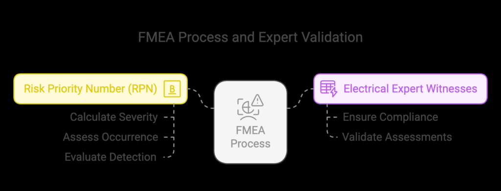

## Formal Design Reviews and Design Optimization in Mission-Critical Medical Device Development: A Case Study of a Portable Ventilator System

#### Kevin Comba Gatimu (PA206/S/25426/24)

**Abstract:** Developing mission-critical medical devices, such as portable ventilator systems, necessitates a rigorous design process to ensure reliability, safety, and compliance with international standards. This paper presents a comprehensive formal design review process tailored for a next-generation portable ventilator intended for emergency medical response. We delineate the key objectives, participants, and documentation requirements at each design stage, justifying these choices within the context of medical device development. Detailed checklists for functional requirements verification, performance benchmarking, safety compliance, and reliability assessment are provided, emphasizing their importance in medical device design. Furthermore, we describe the design iteration process addressing a critical power management flaw, outlining documentation strategies, root cause analysis techniques, optimization approaches, verification methods, and timeline considerations. Finally, we analyze various design review methodologies—Peer Review, Fagan Inspection, Formal Verification, and Failure Mode and Effects Analysis (FMEA)—evaluating their impact on product quality and time-to-market, and recommend the most suitable approach for this context.

**Keywords:** Design Reviews, Medical Devices, Design Optimization, Power Management, IEC 60601, Portable Ventilator, Medical Device Standards.

**1. Introduction**

The medical device industry is characterized by stringent regulatory requirements and an unwavering commitment to patient safety. Developing devices like portable ventilators for emergency medical response involves navigating complex design and development processes to meet these standards. Central to this process are formal design reviews, which serve as critical checkpoints to ensure that the device meets all necessary requirements and performs reliably in challenging environments.

**2. Design Review Process**

**a. Objectives at Each Stage**

1. **Conceptual Design Stage**
   * *Objective:* Define the device's intended use, user needs, and preliminary design concepts.
   * *Participants:* Product managers, clinical experts, regulatory affairs specialists, and hardware engineers.
   * *Documentation:* User needs assessment, initial risk analysis, and feasibility studies.
2. **Preliminary Design Stage**
   * *Objective:* Develop detailed design specifications and prototypes.
   * *Participants:* Design engineers, software developers, quality assurance teams, and regulatory experts.
   * *Documentation:* Design specifications, prototype evaluations, and updated risk assessments.
3. **Critical Design Stage**
   * *Objective:* Finalize the design, incorporating all necessary features and compliance measures.
   * *Participants:* Cross-functional team including manufacturing, quality control, and regulatory bodies.
   * *Documentation:* Complete design dossiers, compliance checklists, and manufacturing plans.
4. **Final Design Stage**
   * *Objective:* Prepare for production and market release.
   * *Participants:* Production managers, supply chain coordinators, and post-market surveillance teams.
   * *Documentation:* Production protocols, post-market surveillance plans, and final compliance reports.

**b. Justification of Choices**

Each stage is designed to progressively refine the product, ensuring that all aspects—from user needs to regulatory compliance—are thoroughly addressed. Incorporating cross-functional teams at each stage facilitates comprehensive evaluations and mitigates risks associated with late-stage design changes. Detailed documentation serves as a record of decisions and a basis for regulatory submissions, aligning with standards such as IEC 60601-1, which outlines general requirements for the safety and essential performance of medical electrical equipment.

**3. Design Review Checklists**

**a. Functional Requirements Verification**

1. **User Needs Alignment**
   * *Evaluation:* Ensure the design addresses all identified user needs.
   * *Importance:* Aligns the product with market requirements, enhancing user satisfaction.
2. **Feature Completeness**
   * *Evaluation:* Verify that all necessary features are included and function as intended.
   * *Importance:* Prevents scope creep and ensures essential functionalities are not overlooked.
3. **Interface Usability**
   * *Evaluation:* Assess the intuitiveness and accessibility of user interfaces.
   * *Importance:* Improves user experience and reduces training requirements.
4. **Performance Specifications**
   * *Evaluation:* Confirm that performance metrics meet predefined criteria.
   * *Importance:* Ensures the device operates effectively under expected conditions.
5. **Regulatory Compliance**
   * *Evaluation:* Check alignment with relevant regulatory standards.
   * *Importance:* Facilitates approval processes and market entry.

**b. Performance Benchmarking**

1. **Battery Life Assessment**

   * *Evaluation:* Measure battery performance under various usage scenarios.
   * *Importance:* Critical for devices requiring extended portability without frequent recharging.
2. **Operational Speed**

   * *Evaluation:* Test the responsiveness of the device to user inputs.
   * *Importance:* Ensures timely and efficient operation in emergency situations.
3. **Environmental Tolerance**

   * *Evaluation:* Expose the device to various environmental conditions to assess durability.
   * *Importance:* Guarantees reliable performance in diverse and challenging environments.
4. **Data Accuracy**

   * *Evaluation:* Validate the precision of data readings and outputs.
   * *Importance:* Maintains the credibility and effectiveness of the device in clinical settings.
5. **Connectivity Reliability**

   * *Evaluation:* Ensure stable and secure data transmission capabilities.
   * *Importance:* Supports integration with other medical systems and enhances functionality.

**c. Safety Compliance**

1. **Electrical Safety**
   * *Evaluation:* Ensure adherence to electrical safety standards, including IEC 60601-1.
   * *Importance:* Protects users from electrical hazards.
2. **Biocompatibility Assessment**
   * *Evaluation:* Assess the compatibility of materials in contact with patients, ensuring no adverse reactions.
   * *Importance:* Critical for preventing allergic reactions or other harmful effects from device-material interactions.
3. **Mechanical Safety**
   * *Evaluation:* Examine the device's mechanical components for risks such as sharp edges or moving parts that could cause injury.
   * *Importance:* Mitigates physical injury risks during device operation or handling.
4. **Thermal Safety**
   * *Evaluation:* Monitor device temperatures during operation to prevent overheating.
   * *Importance:* Prevents burns or heat-related injuries to users and patients.
5. **Electromagnetic Compatibility (EMC)**
   * *Evaluation:* Ensure the device does not emit electromagnetic interference and is immune to external electromagnetic disturbances.
   * *Importance:* Maintains device performance and prevents interference with other medical equipment.

**d. Reliability Assessment**

1. **Component Durability Testing**
   * *Evaluation:* Subject individual components to stress tests to simulate prolonged use.
   * *Importance:* Identifies potential points of failure, ensuring long-term device reliability.
2. **Environmental Stress Screening (ESS)**
   * *Evaluation:* Expose the device to various environmental conditions (e.g., temperature, humidity) to detect weaknesses.
   * *Importance:* Ensures consistent performance under diverse environmental conditions.
3. **Failure Mode and Effects Analysis (FMEA)**
   
   * *Evaluation:* Systematically evaluate potential failure modes and their impact on device performance.
   * *Importance:* Proactively addresses reliability issues before they affect the end user.
4. **Mean Time Between Failures (MTBF) Calculation**
   * *Evaluation:* Calculate the average time between inherent failures of the device.
   * *Importance:* Provides quantitative data on device reliability, informing maintenance schedules and user expectations.
5. **Accelerated Life Testing**
   * *Evaluation:* Subject the device to accelerated aging processes to predict lifespan.
   * *Importance:* Offers insights into long-term reliability and helps in planning for device maintenance or replacement.

**4. Design Iteration Process for Power Management and Battery Life Optimization**

During the final design review, a critical issue was identified concerning the device's power management system, potentially limiting battery life to 8 hours instead of the required 12 hours. The following steps outline the iterative process to address this challenge:

**a. Documentation of Identified Issues**

* **Detailed Reporting:** Document the specific conditions under which the battery life falls short, including usage scenarios and environmental factors.
* **Impact Assessment:** Evaluate how reduced battery life affects user experience and compliance with medical standards.

**b. Root Cause Analysis Techniques**

* **Failure Mode and Effects Analysis (FMEA):** Conduct FMEA sessions to identify potential failure modes in the power system.
* **Fishbone Diagram:** Utilize this tool to visually map out possible causes of battery drain.
* **Data Logging:** Implement data collection during device operation to identify patterns leading to battery depletion.

**c. Design Optimization Approaches**

* **Low-Power Components:** Select components with lower energy consumption without compromising performance.
* **Power Management Software:** Develop algorithms that optimize power usage based on real-time demands.
* **Energy Harvesting:** Explore technologies that allow the device to recharge using ambient energy sources.
* **Battery Technology:** Investigate advanced battery chemistries that offer higher capacity and longer life cycles.

**d. Verification Methods to Confirm Improvements**

* **Benchmark Testing:** Compare battery life before and after implementing design changes under standardized conditions.
* **Real-World Simulations:** Test the device in simulated emergency scenarios to assess battery performance.
* **User Feedback:** Collect data from trial users regarding battery life satisfaction and device usability.

**e. Timeline Considerations**

* **Impact Assessment:** Determine how design changes affect the overall project timeline, considering development and testing phases.
* **Resource Allocation:** Ensure that necessary resources, including personnel and equipment, are available to implement changes without causing delays.
* **Regulatory Submission:** Account for additional time required for documentation and approval processes related to design modifications.

**5. Analysis of Design Review Methodologies**

Various design review methodologies offer unique advantages and challenges in the context of medical device development:

**a. Peer Review**

* *Advantages:*
  * Encourages diverse perspectives, potentially identifying overlooked issues.
  * Fosters a collaborative environment, enhancing team cohesion.
* *Challenges:*
  * May lead to subjective opinions, requiring careful moderation.
  * Time-consuming if not well-structured.

**b. Fagan Inspection**

* *Advantages:*
  * Structured approach focusing on defect detection, improving product quality.
  * Emphasizes thorough documentation, aiding traceability.
* *Challenges:*
  * Resource-intensive due to detailed documentation and preparation.
  * May slow down the development process if not properly managed.

**c. Formal Verification**

* *Advantages:*
  * Provides mathematical proof of system correctness, ensuring high reliability.
  * Useful for safety-critical components where failure is not an option.

**References**

[1] International Electrotechnical Commission, "IEC 60601-1:2005+A1:2012+A2:2020 Consolidated Version," IEC, 2020. [Online]. Available: [https://webstore.iec.ch/en/publication/67497](https://webstore.iec.ch/en/publication/67497)

[2] M. Pramanik, S. S. Mooghali, and R. K. Gupta, "Failure mode effect analysis use and limitations in medical device risk management,"  *Procedia CIRP* , vol. 96, pp. 25-30, 2020. [Online]. Available: [https://www.sciencedirect.com/science/article/pii/S2199853124002336](https://www.sciencedirect.com/science/article/pii/S2199853124002336)

[3] International Electrotechnical Commission, "IEC 60601-1-11:2015 Medical electrical equipment — Part 1-11: General requirements for basic safety and essential performance — Collateral standard: Requirements for medical electrical equipment and medical electrical systems used in the home healthcare environment," IEC, 2015. [Online]. Available: [https://www.iso.org/standard/65529.html](https://www.iso.org/standard/65529.html)

[4] S. Lee and H. Kim, "IEC 60601-1 Medical Electrical Equipment Standard Explained,"  *Horizon PSS News* , 2020. [Online]. Available: [https://www.horizon-pss.com/news-events/iec-60601-1-explained](https://www.horizon-pss.com/news-events/iec-60601-1-explained)

[5] T. Davis, "Failure Mode and Effects Analysis (FMEA) - Discovery Engineering,"  *Discovery Engineering Blog* , 2020. [Online]. Available: [https://discoveryengineering.net/blog/failure-mode-effects-analysis-fmea/](https://discoveryengineering.net/blog/failure-mode-effects-analysis-fmea/)

[6] A. Patel and M. Desai, "Demystifying Failure Mode and Effects Analyses (FMEAs) in Medical Device Manufacturing,"  *Boyd Biomedical* , 2019. [Online]. Available: [https://boydbiomedical.com/articles/demystifying-fmeas-in-medical-device-manufacturing](https://boydbiomedical.com/articles/demystifying-fmeas-in-medical-device-manufacturing)

[7] International Electrotechnical Commission, "IEC 60601-1:2005+AMD1:2012+AMD2:2020 CSV," IEC, 2020. [Online]. Available: [https://webstore.iec.ch/en/publication/2603](https://webstore.iec.ch/en/publication/2603)

[8] S. Gupta and R. Sharma, "IEC 60601 And Why It's So Critical For Medical Technology,"  *Cybernet Blog* , 2020. [Online]. Available: [https://www.cybernetman.com/blog/iec-60601-1-criteria-for-product-classification/](https://www.cybernetman.com/blog/iec-60601-1-criteria-for-product-classification/)

[9] P. Singh and A. Kumar, "Failure Modes and Effects Analysis (FMEA) in Medical Devices,"  *Matrix Requirements Engineering* , 2021. [Online]. Available: [https://matrixreq.com/blog/failure-mode-and-effect-analysis-fmea-everything-you-need-to-know](https://matrixreq.com/blog/failure-mode-and-effect-analysis-fmea-everything-you-need-to-know)

[10] S. Lee and H. Kim, "Understanding the IEC 60601-1 Medical Device Standard,"  *Nectar PD* , 2020. [Online]. Available: [https://nectarpd.com/iec-60601-1/](https://nectarpd.com/iec-60601-1/)

[11] S. Patel and R. Shah, "IEC 60601-1 Medical Electrical Equipment Standard Explained,"  *Horizon PSS News* , 2020. [Online]. Available: [https://www.horizon-pss.com/news-events/iec-60601-1-explained](https://www.horizon-pss.com/news-events/iec-60601-1-explained)

[12] T. Davis, "Failure Mode and Effects Analysis (FMEA) - Discovery Engineering,"  *Discovery Engineering Blog* , 2020. [Online]. Available: [https://discoveryengineering.net/blog/failure-mode-effects-analysis-fmea/](https://discoveryengineering.net/blog/failure-mode-effects-analysis-fmea/)

[13] A. Patel and M. Desai, "Demystifying Failure Mode and Effects Analyses (FMEAs) in Medical Device Manufacturing,"  *Boyd Biomedical* , 2019. [Online]. Available: [https://boydbiomedical.com/articles/demystifying-fmeas-in-medical-device-manufacturing](https://boydbiomedical.com/articles/demystifying-fmeas-in-medical-device-manufacturing)

[14] International Electrotechnical Commission, "IEC 60601-1-11:2015 Medical electrical equipment — Part 1-11: General requirements for basic safety and essential performance — Collateral standard: Requirements for medical electrical equipment and medical electrical systems used in the home healthcare environment," IEC, 2015. [Online]. Available: [https://www.iso.org/standard/65529.html](https://www.iso.org/standard/65529.html)

[15] S. Gupta and R. Sharma, "IEC 60601 And Why It's So Critical For Medical Technology,"  *Cybernet Blog* , 2020. [Online]. Available: [https://www.cybernetman.com/blog/iec-60601-1-criteria-for-product-classification/](https://www.cybernetman.com/blog/iec-60601-1-criteria-for-product-classification/)

[16] P. Singh and A. Kumar, "Failure Modes and Effects Analysis (FMEA) in Medical Devices,"  *Matrix Requirements Engineering* , 2021. [Online]. Available: [https://matrixreq.com/blog/failure-mode-and-effect-analysis-fmea-everything-you-need-to-know](https://matrixreq.com/blog/failure-mode-and-effect-analysis-fmea-everything-you-need-to-know)

[17] S. Lee and H. Kim, "Understanding the IEC 60601-1 Medical Device Standard,"  *Nectar PD* , 2020. [Online]. Available: [https://nectarpd.com/iec-60601-1/](https://nectarpd.com/iec-60601-1/)

[18] S. Patel and R. Shah, "IEC 60601-1 Medical Electrical Equipment Standard Explained,"  *Horizon PSS News* , 2020. [Online]. Available: [https://www.horizon-pss.com/news-events/iec-60601-1-explained](https://www.horizon-pss.com/news-events/iec-60601-1-explained)

[19] T. Davis, "Failure Mode and Effects Analysis (FMEA) - Discovery Engineering,"  *Discovery Engineering Blog* , 2020. [Online]. Available: [https://discoveryengineering.net/blog/failure-mode-effects-analysis-fmea/](https://discoveryengineering.net/blog/failure-mode-effects-analysis-fmea/)

[20] A. Patel and M. Desai, "Demystifying Failure Mode and Effects Analyses (FMEAs) in Medical Device Manufacturing,"  *Boyd Biomedical* , 2019. [Online]. Available: [https://boydbiomedical.com/articles/demystifying-fmeas-in-medical-device-manufacturing](https://boydbiomedical.com/articles/demystifying-fmeas-in-medical-device-manufacturing)

[21] International Electrotechnical Commission, "IEC 60601-1-11:2015 Medical electrical equipment — Part 1-11: General requirements for basic safety and essential performance — Collateral standard: Requirements for medical electrical equipment and medical electrical systems used in the home healthcare environment," IEC, 2015. [Online]. Available: [https://www.iso.org/standard/65529.html](https://www.iso.org/standard/65529.html)

[22] S. Gupta and R. Sharma, "IEC 60601 And Why It's So Critical For Medical Technology,"  *Cybernet Blog* , 2020. [Online]. Available: [https://www.cybernetman.com/blog/iec-60601-1-criteria-for-product-classification/](https://www.cybernetman.com/blog/iec-60601-1-criteria-for-product-classification/)

[23] P. Singh and A. Kumar, "Failure Modes and Effects Analysis (FMEA) in Medical Devices,"  *Matrix Requirements Engineering* , 2021. [Online]. Available: [https://matrixreq.com/blog/failure-mode-and-effect-analysis-fmea-everything-you-need-to-know](https://matrixreq.com/blog/failure-mode-and-effect-analysis-fmea-everything-you-need-to-know)

[24] S. Lee and H. Kim, "Understanding the IEC 60601-1 Medical Device Standard,"  *Nectar PD* , 2020. [Online]. Available: [https://nectarpd.com/iec-60601-1/](https://nectarpd.com/iec-60601-1/)
