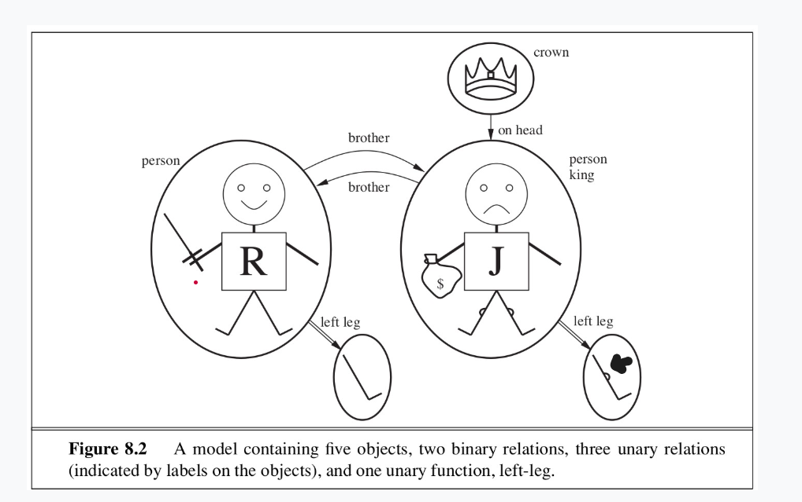
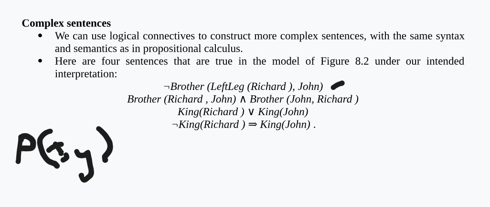

## Introduction to Artificial Intelligence

### What is Artificial Intelligence (AI)?

Artificial Intelligence (AI) refers to the field of study and engineering focused on building machines or systems that can simulate human intelligence. AI aims to not only understand how humans think and reason but to replicate and create intelligent behavior in machines. The term was coined in 1956, and since then, AI has been divided into various subfields, such as machine learning, robotics, natural language processing, and expert systems.

AI can be understood through different approaches:

1. **Acting Humanly (Behavioral Approach)**: This approach seeks to make machines exhibit intelligent behavior similar to humans. The Turing Test, proposed by Alan Turing in 1950, is one way to evaluate this by testing if a machine's responses are indistinguishable from those of a human in a conversation.
2. **Thinking Humanly (Cognitive Approach)**: This approach involves understanding how human beings think, using cognitive science methods such as psychological experiments and brain imaging to model human cognition in machines.
3. **Thinking Rationally (Logical Approach)**: This approach is grounded in logic and reasoning. The idea is to formalize the process of correct reasoning and use it in machines to perform tasks based on rational decision-making.
4. **Acting Rationally (Rational Agent Approach)**: A rational agent is an entity that acts to achieve the best outcome based on its knowledge. This approach emphasizes building intelligent systems that make decisions to achieve defined goals, even if there’s uncertainty involved.

---

### The Foundations of Artificial Intelligence

AI's foundations draw from several disciplines, each contributing essential ideas and methods:

1. **Philosophy**:

   - Ancient philosophers like Aristotle focused on reasoning and logic, shaping the foundation for formal logic used in AI. Philosophical questions such as "How does the mind arise from the brain?" and "Where does knowledge come from?" are key to understanding AI’s objectives.
2. **Mathematics**:

   - Mathematics, particularly in logic and computation, is central to AI. Key developments in formal logic (e.g., George Boole’s Boolean logic and Gottlob Frege’s first-order logic) laid the groundwork for building algorithms capable of deduction and reasoning.
   - The concept of computation, introduced by pioneers like Alan Turing, defines what can and cannot be computed, providing a theoretical basis for AI.
3. **Neuroscience**:

   - Neuroscience has provided insights into how the brain processes information, offering inspiration for neural networks and understanding complex cognitive functions. Concepts such as neurons and their connections influence the design of AI systems that mimic brain-like functions.
4. **Psychology**:

   - The study of human and animal cognition has informed the development of AI models that simulate mental processes. Psychological theories about memory, perception, and reasoning have been instrumental in shaping AI research.
5. **Economics and Decision Theory**:

   - Decision theory, particularly from economists like John von Neumann, has contributed to AI's focus on optimal decision-making. AI models often incorporate probabilistic reasoning and utility theory to make decisions under uncertainty.
6. **Computer Engineering**:

   - Advances in computer hardware and software have enabled the rapid growth of AI. From early computers to modern machines capable of processing vast amounts of data, the development of computational tools has been crucial for the realization of AI.
7. **Control Theory and Cybernetics**:

   - Control theory focuses on building systems that can autonomously regulate themselves based on feedback from the environment. This idea influenced the development of AI systems capable of operating autonomously and adapting to changing conditions.
8. **Linguistics**:

   - Linguistics, particularly computational linguistics, has significantly influenced natural language processing in AI. Understanding how humans use and process language has been key to building AI systems that can communicate effectively.

---

## Intelligent Agents

### Agents and Environment

**1. Agents and their Environment**

- **Agent**: An agent is anything that perceives its environment through sensors and acts upon it via actuators. For example:
  - A human agent uses eyes, ears, and limbs as sensors and actuators.
  - A robotic agent may use cameras, infrared sensors, and motors.
  - A software agent uses digital inputs like keystrokes and network packets and outputs via the screen, files, or network.
- **Percepts**: The immediate sensory inputs an agent receives.
- **Percept Sequence**: The history of all perceptions the agent has experienced.
- **Agent Function**: A mathematical description that maps percept sequences to actions.
- **Agent Program**: The practical implementation of the agent function, which is executed within a physical system (like a robot or computer).

**Example**: A vacuum cleaner agent in a simple world with two locations (A and B) can decide actions like moving or sucking dirt based on the percepts (location and cleanliness) it receives.

---

### Good Behavior - Concept of Rationality

**2. Rational Agent**

- **Rationality**: The agent's behavior is considered rational if it maximizes its performance measure, based on its perceptions and built-in knowledge of the environment.
- **Performance Measure**: A function that defines how to evaluate the agent’s actions based on the environment's states.
- **Rational Agent Definition**: An agent is rational if it selects actions that maximize its expected performance measure, given its percept sequence and knowledge.
- **Rationality vs. Omniscience**: Rational agents are not omniscient and do not know the outcome of their actions in advance; they act based on expected outcomes.

---

### Nature of Environment

**3. Task Environment**

- **PEAS**: Performance measure, Environment, Actuators, and Sensors.
- **Task Environment Specification**: Defines the parameters and constraints within which an agent operates. The environment may vary in complexity and limitations, which affects the agent design.

**Key Properties of Task Environments**:

- **Observability**: Fully observable or partially observable based on available sensors.
- **Determinism**: Whether the environment’s state is fully determined by the agent’s actions (deterministic) or involves some randomness (stochastic).
- **Episodic vs. Sequential**: In episodic environments, actions do not affect future decisions, while in sequential environments, past actions influence future decisions.
- **Dynamic vs. Static**: Dynamic environments change while the agent is deliberating, whereas static ones do not.
- **Discrete vs. Continuous**: The state of the environment, time, and actions can be discrete or continuous.
- **Known vs. Unknown**: Whether the agent has full knowledge of the environment's rules or has to learn over time.

---

### Structure of Agents

**4. Structure of Intelligent Agents**

- **Agent Program**: This program dictates the actions based on the agent’s perceptions.
- **Architecture**: The underlying computing system that runs the agent program and interacts with the environment through sensors and actuators.
- **Agent Types**:
  1. **Simple Reflex Agents**: Act based on the current percept, with no memory of previous states.
  2. **Model-based Reflex Agents**: Maintain an internal state to handle partial observability by keeping track of unobserved parts of the environment.
  3. **Goal-based Agents**: Use goals to guide action selection, considering future consequences and sequences of actions.
  4. **Utility-based Agents**: Consider not just achieving goals but doing so in the best possible way by maximizing utility.

**Example of a Simple Reflex Agent**: A vacuum agent that performs the action "Suck" if the square is dirty and moves in another direction otherwise.

**Goal-based and Utility-based Agents**:

- Goal-based agents make decisions based on achieving specific goals, whereas utility-based agents aim to maximize a utility function that evaluates different outcomes of an action.

**5. Learning Agents**

- **Learning Element**: This component learns from experience and feedback to improve future performance.
- **Performance Element**: The part of the agent that selects actions based on its current knowledge.
- **Critic**: Provides feedback on the agent’s performance to guide learning.
- **Problem Generator**: Suggests actions for the agent to explore, helping it learn better strategies.

Learning agents improve their behavior over time, adapting to changing environments and new challenges.

This framework helps in understanding the vast diversity of intelligent agents and how they can be designed to operate effectively in various environments.

---

## Problem Solving Agents

### **Problem-Solving Agents**

In this section, we explore **problem-solving agents**, which are goal-based agents that aim to find a sequence of actions to achieve a goal when no single action will suffice. The agent starts from an **initial state** and proceeds through a sequence of actions to reach the **goal state**.

#### **1. Types of Agents:**

- **Reflex Agents**: These are simple agents that act based on a direct mapping from states to actions. They don’t consider future actions or long-term consequences.
- **Goal-Based Agents**: These agents consider future actions and their outcomes. They are more flexible and can solve complex problems by adopting specific goals.
- **Problem-Solving Agents**: These are a specific type of goal-based agent. They use **atomic representations** (states of the world are considered as wholes) to navigate problem spaces, as described in **Section 2.4.7**.

#### **2. Problem Formulation**:

A **problem** consists of five components:

- **Initial State**: The starting state of the agent. For example, in the Romania problem, the agent starts in the city of Arad.
- **Actions**: The possible actions that the agent can take. For example, in the Romania problem, the agent can go from one town to another.
- **Transition Model**: Describes the effect of each action. For example, moving from Arad to Sibiu leads to the new state of being in Sibiu.
- **Goal Test**: A test that checks if the agent has reached the goal state (e.g., in Romania, the goal is to reach Bucharest).
- **Path Cost**: The cost associated with each action. For example, the cost of traveling between cities could be measured in distance (kilometers).

#### **3. Goal Formulation and Problem Solving**:

- **Goal Formulation**: The process of defining the desired goal(s) and deciding which states are considered part of the goal. It limits the problem-solving process by focusing on relevant objectives.
- **Problem Formulation**: Deciding which states and actions to consider for the goal. The level of abstraction is crucial here. For example, in a navigation problem, the agent may choose to abstract the problem at the level of towns rather than focusing on individual streets.

#### **4. Search Process**:

The agent uses a search algorithm to find a sequence of actions that leads to the goal. This process involves:

1. **Problem Formulation**: Defining the problem space (initial state, actions, transition model, etc.).
2. **Search**: The agent uses a search algorithm (uninformed or informed) to explore possible paths and find a solution.
3. **Execution**: Once the solution (action sequence) is found, the agent follows it step by step to reach the goal.

- **Uninformed Search**: These search algorithms have no additional information about the problem other than its definition. Examples include **breadth-first search** and **depth-first search**.
- **Informed Search**: These algorithms use additional knowledge (heuristics) to guide the search and make it more efficient. Examples include **A* search**.

#### **5. Solution Representation**:

- A **solution** to a problem is a sequence of actions that transforms the initial state to the goal state.
- **Optimal Solution**: This is the solution with the lowest path cost among all possible solutions.

---

### **Example Problems**:

#### **1. Toy Problems**:

- **Vacuum World**: A simple environment where an agent moves between two locations, cleaning them. The goal is to clean both locations.

  - **States**: The state is determined by the agent’s location and whether the locations are clean.
  - **Actions**: Move Left, Move Right, Suck.
  - **Goal Test**: All locations are clean.
  - **Path Cost**: Each step has a cost of 1.
- **8-Puzzle**: A sliding puzzle with a 3×3 board, where the goal is to arrange tiles in a specific order.

  - **States**: The position of the 8 tiles and the blank space.
  - **Actions**: Slide tiles (Left, Right, Up, Down).
  - **Goal Test**: The tiles are arranged in a specific goal configuration.
  - **Path Cost**: Each move has a cost of 1.
- **8-Queens Problem**: Place 8 queens on a chessboard such that no queen attacks another.

  - **States**: Any arrangement of 0 to 8 queens on the board.
  - **Actions**: Add a queen to an empty square.
  - **Goal Test**: 8 queens are on the board, none attacked.
  - **Path Cost**: The path cost is irrelevant, only the final configuration matters.

    Here is the full problem description with requirements and a breakdown of **States**, **Actions**, **Goal Test**, and **Path Cost** for both the **Missionaries and Cannibals Problem** and the **Water Jug Problem**:

---

### **Missionaries and Cannibals Problem**

#### **Problem Description:**

There are three missionaries and three cannibals on one side of a river. They need to cross the river using a boat that can hold at most two people. The challenge is to transport all the missionaries and cannibals to the opposite side without violating the rule that at no point on either side of the river can the cannibals outnumber the missionaries. If the cannibals outnumber the missionaries on either side, the cannibals will eat the missionaries.

#### **Requirements:**

- The boat can hold only two people at a time.
- The goal is to get all the missionaries and cannibals to the opposite bank.
- The number of cannibals cannot exceed the number of missionaries on either side of the river at any point.

#### **Problem Formulation:**

1. **States**:

   - A state can be represented as a tuple `(M_left, C_left, M_right, C_right, Boat)`, where:
     - `M_left`: The number of missionaries on the left bank.
     - `C_left`: The number of cannibals on the left bank.
     - `M_right`: The number of missionaries on the right bank.
     - `C_right`: The number of cannibals on the right bank.
     - `Boat`: Denotes where the boat is (either left or right bank).

   **Example state**: `(3, 3, 0, 0, 'left')` means all three missionaries and all three cannibals are on the left bank, and the boat is on the left side.
2. **Actions**:

   - **Send 1 missionary across**: Move 1 missionary from one side to the other.
   - **Send 1 cannibal across**: Move 1 cannibal from one side to the other.
   - **Send 2 missionaries across**: Move 2 missionaries from one side to the other.
   - **Send 2 cannibals across**: Move 2 cannibals from one side to the other.
   - **Send 1 missionary and 1 cannibal across**: Move 1 missionary and 1 cannibal from one side to the other.
   - **Bring 1 person back**: Move 1 person (either a missionary or a cannibal) back to the starting bank.
3. **Goal Test**:

   - The goal is to have all the missionaries and cannibals on the right bank with the boat on the right side: `(0, 0, 3, 3, 'right')`.
4. **Path Cost**:

   - The path cost can be the number of actions (steps) taken to reach the goal. Each action can have a uniform cost (e.g., cost = 1 per action).

---

### **Water Jug Problem**

#### **Problem Description:**

You are given two empty water jugs:

- One jug holds 4 gallons of water.
- The other jug holds 3 gallons of water.

The task is to fill the 4-gallon jug with exactly 2 gallons of water using the jugs and performing the appropriate actions.

#### **Requirements:**

- You can fill either jug from a water source or pour water from one jug to the other.
- The goal is to get exactly 2 gallons of water in the 4-gallon jug.
- You are only allowed to work with the two jugs (4-gallon and 3-gallon), and their capacities are fixed.

#### **Problem Formulation:**

1. **States**:

   - A state can be represented as a tuple `(jug_4, jug_3)`, where:
     - `jug_4`: The amount of water in the 4-gallon jug (ranging from 0 to 4 gallons).
     - `jug_3`: The amount of water in the 3-gallon jug (ranging from 0 to 3 gallons).

   **Example state**: `(4, 0)` means the 4-gallon jug is full (4 gallons), and the 3-gallon jug is empty.
2. **Actions**:

   - **Fill 4-gallon jug**: Fill the 4-gallon jug to its capacity.
   - **Fill 3-gallon jug**: Fill the 3-gallon jug to its capacity.
   - **Pour from 4-gallon jug to 3-gallon jug**: Pour water from the 4-gallon jug into the 3-gallon jug until the 3-gallon jug is full or the 4-gallon jug is empty.
   - **Pour from 3-gallon jug to 4-gallon jug**: Pour water from the 3-gallon jug into the 4-gallon jug until the 4-gallon jug is full or the 3-gallon jug is empty.
   - **Empty the 4-gallon jug**: Empty all the water in the 4-gallon jug.
   - **Empty the 3-gallon jug**: Empty all the water in the 3-gallon jug.
3. **Goal Test**:

   - The goal is to have exactly **2 gallons** of water in the 4-gallon jug. Therefore, the goal state is `(2, x)` where `x` can be any amount of water in the 3-gallon jug (0 ≤ x ≤ 3).
4. **Path Cost**:

   - The path cost can be the number of actions (steps) taken to reach the goal. Each action can have a uniform cost (e.g., cost = 1 per action).

---

### Summary of Problem Formulation for Both Problems:

#### **Missionaries and Cannibals**:

- **States**: A tuple of missionaries and cannibals on both banks and the position of the boat.
- **Actions**: Sending missionaries and cannibals across the river.
- **Goal Test**: All missionaries and cannibals are on the right bank.
- **Path Cost**: Number of actions taken to reach the goal.

#### **Water Jug**:

- **States**: Amount of water in both the 4-gallon and 3-gallon jugs.
- **Actions**: Fill and pour between the jugs.
- **Goal Test**: Exactly 2 gallons of water in the 4-gallon jug.
- **Path Cost**: Number of actions taken to achieve the goal.

These formulations help define the problem-solving process, guiding an AI agent in finding a solution using algorithms such as search or planning.

#### **2. Real-World Problems**:

- **Route-Finding Problem**: Find the shortest route between two locations, such as in the Romania problem.

  - **States**: Locations, times, and other relevant information.
  - **Actions**: Travel from one location to another.
  - **Goal Test**: Reaching the destination.
  - **Path Cost**: Depends on distance, time, and other factors like cost and delays.
- **Touring Problem**: Visit every city at least once and return to the starting point, similar to the **Traveling Salesperson Problem (TSP)**.

  - **States**: The set of cities visited.
  - **Actions**: Move between cities.
  - **Goal Test**: All cities have been visited, and the agent has returned to the start.
  - **Path Cost**: Minimize the total distance traveled.
- **Protein Design**: Finding the sequence of amino acids that will fold into a protein with the desired properties.

  - **States**: Possible sequences of amino acids.
  - **Actions**: Mutate or rearrange the sequence.
  - **Goal Test**: The protein folds correctly to meet the desired properties.
  - **Path Cost**: Depends on the computational cost of evaluating protein folds.

---

This summary provides a clear breakdown of the problem-solving agent approach, problem formulation, and the types of problems (both toy and real-world) that AI agents can address. The key concepts—such as state space, goal test, and search algorithms—are crucial for developing intelligent systems capable of solving complex tasks.

## Knowledge Representation

In Artificial Intelligence (AI) and Expert Systems, a **first-order logic (FOL)** is a formal system used for representing and reasoning about knowledge. First-order logic is often the foundation for creating expert systems and AI models that can perform logical reasoning, which is central to decision-making and problem-solving.

Here’s a basic breakdown of first-order logic in AI:

### 1. **Syntax of First-Order Logic:**

* **Constants:** Specific objects or individuals in the domain (e.g., `John`, `apple`).
* **Variables:** Symbols that stand for objects (e.g., `x`, `y`).
* **Predicates:** Functions that represent properties of objects or relationships between objects (e.g., `Likes(John, Apple)` to express that John likes the apple).
* **Functions:** Functions that return objects (e.g., `MotherOf(John)` could return the mother of John).
* **Quantifiers:**
  * **Universal Quantifier (∀):** Expresses that a statement is true for all elements in a domain (e.g., `∀x Likes(x, Apple)` means "everyone likes the apple").
  * **Existential Quantifier (∃):** Expresses that there exists at least one element in the domain that satisfies the statement (e.g., `∃x Likes(x, Apple)` means "someone likes the apple").
* **Logical Connectives:** These include AND ( ∧ ), OR ( ∨ ), NOT ( ¬ ), IMPLIES ( → ), and EQUIVALENT ( ↔ ), which are used to combine or modify logical statements.

### 2. **Semantics of First-Order Logic:**

The semantics of first-order logic involve interpreting the statements in terms of real-world objects, properties, and relationships. The interpretation involves:

* A **domain** (the set of all possible objects being considered).
* An **interpretation** that assigns meanings to constants, predicates, and functions.
* A **model** that provides a truth value (true or false) to each statement in the logic.

### 3. **Inference in First-Order Logic:**

Inference refers to the process of deriving new knowledge from existing knowledge using logical rules. First-order logic is used to reason about facts and derive conclusions.

* **Resolution:** A popular inference technique for FOL. It transforms statements into a form called **clausal form** and then derives conclusions by identifying contradictions.
* **Forward and Backward Chaining:** Methods used in expert systems to deduce conclusions from known facts.

### 4. **Use of First-Order Logic in Expert Systems:**

Expert systems utilize FOL to represent complex knowledge in a way that allows reasoning and problem-solving. For example, an expert system in medicine might represent the knowledge base using predicates like `HasSymptom(Patient, Fever)` and `Diagnoses(Disease, Patient)`.

Expert systems can use logical inference to draw conclusions from a set of known facts (e.g., symptoms) to arrive at diagnoses or decisions. The system's reasoning is based on the rules and knowledge represented using FOL.

### 5. **Example:**

Let's say we have a simple expert system that deals with diseases and symptoms.

* **Facts:**
  * `HasSymptom(John, Cough)`
  * `HasSymptom(John, Fever)`
  * `HasSymptom(John, SoreThroat)`
* **Rules:**
  * `Disease(X, Flu) ← HasSymptom(X, Cough) ∧ HasSymptom(X, Fever)`
  * `Disease(X, Cold) ← HasSymptom(X, SoreThroat) ∧ HasSymptom(X, Cough)`
* **Conclusion:** If the expert system knows John has a cough and a fever, it can infer that John might have the flu.

In summary, **first-order logic** is a powerful tool for AI and expert systems, enabling formal reasoning, knowledge representation, and decision-making processes that are central to these systems.

In the context of Artificial Intelligence (AI) and Expert Systems,  **Propositional Logic** ,  **First-Order Logic (FOL)** , and **Special-Purpose Logic** refer to different logical systems that are used for representing knowledge and reasoning. These systems differ in their expressiveness, complexity, and usage for different kinds of tasks. Let’s go over each one:

### 1. **Propositional Logic:**

* **Also known as:** **Sentential Logic** or  **Boolean Logic** .
* **Basic Concept:** Propositional Logic is the simplest form of logic that deals with propositions (or statements) that can be either **true** or  **false** . The basic unit of propositional logic is a  **proposition** , which is a simple declarative statement (e.g., "The sky is blue", "It is raining").
* **Components:**
  * **Propositions** : Represent basic statements, like `P`, `Q`, `R`.
  * **Logical Connectives** : Operators that combine propositions, such as:
  * **AND ( ∧ )** : Both propositions must be true.
  * **OR ( ∨ )** : At least one of the propositions must be true.
  * **NOT ( ¬ )** : The negation of a proposition.
  * **IMPLIES ( → )** : A conditional relationship between two propositions (If P, then Q).
* **Limitations** :
* Propositional logic does not deal with the internal structure of propositions, meaning it cannot represent relationships or properties of objects.
* It is limited in expressiveness since it can only handle simple true/false statements without considering their deeper structure or relationships.
* **Example** :
* Let’s say `P` represents "It is raining," and `Q` represents "The ground is wet." The expression `P → Q` means "If it is raining, then the ground is wet."
* **Use in AI:** Propositional logic is used for simpler reasoning tasks where you need to combine and manipulate statements that are either true or false.

### 2. **First-Order Logic (FOL):**

* **Also known as:** **Predicate Logic** or  **Quantified Logic** .
* **Basic Concept:** First-Order Logic is a more expressive and powerful extension of propositional logic. It allows reasoning about  **objects** ,  **properties of objects** , and **relationships between objects** using quantifiers like "for all" (∀) and "there exists" (∃).
* **Components:**
  * **Constants** : Specific objects or individuals (e.g., `John`, `apple`).
  * **Variables** : Symbols that represent objects (e.g., `x`, `y`).
  * **Predicates** : Functions that represent properties or relationships (e.g., `Likes(John, Apple)` means "John likes the apple").
  * **Functions** : Represent functions that return objects (e.g., `MotherOf(John)`).
  * **Quantifiers** :
  * **Universal Quantifier (∀)** : Indicates that a statement holds for all objects in a domain (e.g., `∀x Likes(x, Apple)` means "everyone likes the apple").
  * **Existential Quantifier (∃)** : Indicates that there is at least one object for which the statement is true (e.g., `∃x Likes(x, Apple)` means "someone likes the apple").
* **Advantages Over Propositional Logic** :
* It can represent relationships between objects and reason about general statements (like "all humans are mortal").
* First-order logic can express much more complex and specific relationships than propositional logic.
* **Example** :
* If `Human(x)` denotes "x is a human" and `Mortal(x)` denotes "x is mortal", the statement `∀x (Human(x) → Mortal(x))` means "Everyone who is a human is mortal."
* **Use in AI** : FOL is used in expert systems, knowledge representation, and automated reasoning, as it allows modeling complex domains and reasoning about them systematically.

### 3. **Special-Purpose Logic:**

* **Basic Concept:** Special-Purpose Logic refers to logical systems designed for specific tasks or domains. These logics are tailored to address particular challenges or constraints in certain areas, unlike general-purpose logics like propositional or first-order logic.
* **Examples of Special-Purpose Logic** :
* **Modal Logic** : A system used for reasoning about concepts like possibility, necessity, and time. It is commonly used in AI for reasoning about knowledge, belief, and time (e.g., "It is possible that John will arrive" or "It is necessary for the system to be secure").
* **Temporal Logic** : Used for reasoning about time and the temporal ordering of events. This is useful in applications like planning and reasoning about actions over time.
* **Description Logic** : Often used in the context of ontologies and knowledge representation (e.g., in the Web Ontology Language - OWL). Description logic focuses on the representation of concepts and their relationships in a structured and formal way.
* **Default Logic** : A form of non-monotonic logic used to deal with reasoning in the presence of incomplete information. For instance, making conclusions based on "default" assumptions unless contradicted by facts (e.g., "Normally, birds fly, but penguins do not").
* **Non-Monotonic Logic** : This type of logic allows reasoning where new information can invalidate previous conclusions. This is in contrast to classical logic, where the addition of new knowledge cannot take away previously established conclusions.
* **Use in AI** : Special-purpose logic is often used in more specific areas of AI, such as temporal reasoning, belief modeling, planning, knowledge representation, and decision-making, where standard logics like FOL or propositional logic are not sufficient.

### Summary of Differences:

| Aspect                   | **Propositional Logic**          | **First-Order Logic**                                            | **Special-Purpose Logic**                                  |
| ------------------------ | -------------------------------------- | ---------------------------------------------------------------------- | ---------------------------------------------------------------- |
| **Expressiveness** | Limited (simple true/false statements) | Highly expressive (deals with objects, relationships, and quantifiers) | Task-specific (focused on certain domains or reasoning types)    |
| **Complexity**     | Simple and easy to use                 | More complex due to quantifiers and predicates                         | Varies by logic (can be complex depending on the logic)          |
| **Use Cases**      | Basic reasoning and decision making    | Knowledge representation, expert systems, automated reasoning          | Temporal reasoning, belief systems, incomplete information, etc. |
| **Examples**       | `P → Q`(If P, then Q)               | `∀x (Human(x) → Mortal(x))`                                        | Modal, Temporal, Description Logic, Default Logic, etc.          |

In summary, **propositional logic** is great for simple logical operations, **first-order logic** extends the capabilities to more complex domains with objects and relations, and **special-purpose logics** are tailored to solve specific problems in particular domains or under certain constraints.

## what is Predicate

In logic, particularly in  **First-Order Logic (FOL)** , a **predicate** is a fundamental building block used to express properties or relationships among objects in a domain. It represents a statement that can be **true** or **false** depending on the values of the variables or objects involved.

### Key Points about Predicates:

1. **Definition** : A **predicate** is essentially a function that takes one or more arguments (objects, variables, constants) and returns a **true** or **false** value based on whether the property or relationship it represents holds for those arguments.
2. **Structure** :

* A predicate typically has a name and a list of arguments (which could be objects, constants, or variables).
* The number of arguments in a predicate is known as its  **arity** . For example, a predicate with one argument is unary, with two arguments is binary, and so on.

    **Example of predicates** :

* Unary Predicate (1 argument): `Likes(John, Apple)` - This means "John likes the apple." It has a  **binary arity** , as it involves two arguments.
* Binary Predicate (2 arguments): `HasParent(John, Mary)` - This means "John has Mary as a parent."
* Ternary Predicate (3 arguments): `Between(John, Park, School)` - This means "John is between the park and the school."

1. **Example with Variables** : A predicate can be used with variables to make general statements.

* `Likes(x, y)` – This represents a general relationship where `x` likes `y`. This is true for specific values of `x` and `y`.

1. **Truth Value** : The truth of a predicate depends on the interpretation of its arguments in a given model (domain). For instance, the predicate `IsTall(John)` could be true or false depending on whether John is tall in the context of the domain.

### Examples:

1. **Unary Predicate** :

* `Human(John)` – This means "John is a human."
  * If the domain of discourse (the set of objects we're considering) is people, then `Human(John)` would evaluate to **true** if John is a human and **false** otherwise.

1. **Binary Predicate** :

* `FatherOf(John, Mary)` – This means "John is the father of Mary."
  * This would be true if John is actually Mary's father, based on the context or domain.

1. **Ternary Predicate** :

* `Between(John, Park, School)` – This means "John is located between the park and the school."
  * This predicate has three arguments, and it expresses a relationship involving those three objects.

### Predicates in First-Order Logic:

In  **First-Order Logic** , predicates are used to build complex logical statements that allow reasoning about relationships, properties, and actions in a formal way. These logical statements can be combined with **quantifiers** (such as ∀ "for all" and ∃ "there exists") to express generalizations or specific instances.

#### Example in FOL:

* **Statement** : "Everyone likes apples."
* Predicate form: `∀x Likes(x, Apple)`
* This means that for all objects `x`, the predicate `Likes(x, Apple)` holds true (i.e., everyone likes apples).
* **Statement** : "There exists someone who likes the apple."
* Predicate form: `∃x Likes(x, Apple)`
* This means there is at least one `x` such that `Likes(x, Apple)` is true.

### Summary:

* A **predicate** in logic represents a property or relationship about objects.
* It is a function that returns a truth value based on its arguments.
* Predicates are used to form logical statements in **First-Order Logic** and are central to reasoning in many AI applications, like expert systems and knowledge representation.

## logical concepts of  **disjunction** ,  **conjunction** ,  **negation** ,  **implication** ,  **premise** , **conclusion**

Let's break down the logical concepts of  **disjunction** ,  **conjunction** ,  **negation** ,  **implication** ,  **premise** ,  **conclusion** , and **rules** using the set of **even** and **odd numbers** between 0 and 10. This set of numbers includes:

* Even numbers: 0, 2, 4, 6, 8, 10
* Odd numbers: 1, 3, 5, 7, 9

### 1. **Disjunction (OR, ∨):**

Disjunction is a logical operation that is **true** if at least one of the operands (propositions) is  **true** .

#### Example:

Let’s define two propositions:

* **P** : "The number is even."
* **Q** : "The number is odd."

Now, the disjunction of P and Q, denoted  **P ∨ Q** , is **true** if the number is either even or odd (which is true for all numbers in the range of 0 to 10).

For instance:

* For the number 2:
  * **P (Even)** is **true** (because 2 is even).
  * **Q (Odd)** is **false** (because 2 is not odd).
  * **P ∨ Q** is **true** (because at least one of the two conditions is true).

For the number 1:

* **P (Even)** is **false** (because 1 is not even).
* **Q (Odd)** is **true** (because 1 is odd).
* **P ∨ Q** is **true** (again, because at least one condition is true).

Thus, for all numbers between 0 and 10, **P ∨ Q** will always be **true** because every number is either even or odd.

### 2. **Conjunction (AND, ∧):**

Conjunction is a logical operation that is **true** only if **both** operands are  **true** .

#### Example:

Let’s use the same propositions:

* **P** : "The number is even."
* **Q** : "The number is odd."

Now, the conjunction of **P ∧ Q** is **true** only if the number is both even and odd, which is impossible in the range of even and odd numbers, so it will always be **false** for any number between 0 and 10.

For instance:

* For the number 2:
  * **P (Even)** is  **true** .
  * **Q (Odd)** is  **false** .
  * **P ∧ Q** is  **false** .

For the number 1:

* **P (Even)** is  **false** .
* **Q (Odd)** is  **true** .
* **P ∧ Q** is  **false** .

Thus, for all numbers, **P ∧ Q** is **always false** since no number can be both even and odd.

### 3. **Negation (NOT, ¬):**

Negation reverses the truth value of a proposition. If the proposition is  **true** , the negation is  **false** , and vice versa.

#### Example:

Let’s define the proposition:

* **P** : "The number is even."

For negation, **¬P** means "The number is **not** even" or "The number is odd."

For instance:

* For the number 2:
  * **P (Even)** is  **true** .
  * **¬P** (Not Even) is **false** (because 2 is even).
* For the number 1:
  * **P (Even)** is  **false** .
  * **¬P** (Not Even) is **true** (because 1 is odd).

Thus, **¬P** simply reverses the truth value of  **P** .

### 4. **Implication (If...then..., →):**

Implication is a logical operation where "If **P** then  **Q** " means that if **P** is true, then **Q** must also be true. If **P** is false, the implication is  **always true** , regardless of  **Q** .

#### Example:

Let’s define:

* **P** : "The number is even."
* **Q** : "The number is greater than 5."

Now, **P → Q** means **"If the number is even, then the number is greater than 5."**

For example:

* For the number 2:
  * **P (Even)** is  **true** .
  * **Q (Greater than 5)** is  **false** .
  * **P → Q** is **false** (because 2 is even, but it’s not greater than 5).
* For the number 4:
  * **P (Even)** is  **true** .
  * **Q (Greater than 5)** is  **false** .
  * **P → Q** is **false** (because 4 is even, but it’s not greater than 5).
* For the number 8:
  * **P (Even)** is  **true** .
  * **Q (Greater than 5)** is  **true** .
  * **P → Q** is **true** (because 8 is even, and it is greater than 5).

For **P → Q** to be true, whenever **P** is true, **Q** must also be true. If **P** is false, **P → Q** is **true** regardless of  **Q** .

### 5. **Premise and Conclusion:**

In logical reasoning, a **premise** is a statement or assumption that is assumed to be true, and a **conclusion** is the statement derived from the premises.

#### Example:

* **Premise 1** : "The number is even." ( **P** )
* **Premise 2** : "The number is greater than 5." ( **Q** )
* **Conclusion** : "The number is even and greater than 5." ( **P ∧ Q** )

For instance, consider the number 8:

* **Premise 1** : "The number is even" is true (because 8 is even).
* **Premise 2** : "The number is greater than 5" is true (because 8 is greater than 5).
* **Conclusion** : "The number is even and greater than 5" is true (because 8 satisfies both premises).

### 6. **Rules:**

Rules in logic are usually conditional statements that describe the relationships between premises and conclusions, such as **if-then** statements.

#### Example of a Rule:

* **Rule** : "If the number is even, then it is divisible by 2."
* **Premise** : The number is even.
* **Conclusion** : The number is divisible by 2.

For the number 6:

* **Premise** : The number is even (6 is even).
* **Conclusion** : The number is divisible by 2 (6 is divisible by 2).

### **Biconditional (If and only if, ↔)**

A **biconditional** (often denoted as  **↔** ) is a logical operation that expresses equivalence between two propositions. It means that both propositions are either **true** or **false** together — they are  **equivalent** .

* **Definition** : The statement " **P if and only if Q** " (denoted as  **P ↔ Q** ) is **true** when:
* Both **P** and **Q** are  **true** , or
* Both **P** and **Q** are  **false** .

In other words, **P ↔ Q** is true when **P** implies **Q** (P → Q) and **Q** also implies **P** (Q → P).

### **Truth Table for Biconditional (P ↔ Q):**

| **P** | **Q** | **P ↔ Q** |
| ----------- | ----------- | ---------------- |
| T           | T           | T                |
| T           | F           | F                |
| F           | T           | F                |
| F           | F           | T                |

* **P ↔ Q** is **true** if both P and Q are either **true** or  **false** .
* **P ↔ Q** is **false** if P and Q have different truth values.

### **Using Biconditionals with Even and Odd Numbers (0-10)**

Let's use the set of even and odd numbers between 0 and 10 again to explain  **biconditionals** .

### **Example 1: "A number is even if and only if it is divisible by 2."**

Let’s define the proposition:

* **P** : "The number is even."
* **Q** : "The number is divisible by 2."

Now, the biconditional **P ↔ Q** means **"The number is even if and only if it is divisible by 2."**

* For the number 2:
  * **P (Even)** is **true** (2 is even).
  * **Q (Divisible by 2)** is **true** (2 is divisible by 2).
  * **P ↔ Q** is **true** (since both P and Q are true).
* For the number 3:
  * **P (Even)** is **false** (3 is not even).
  * **Q (Divisible by 2)** is **false** (3 is not divisible by 2).
  * **P ↔ Q** is **true** (since both P and Q are false).
* For the number 4:
  * **P (Even)** is **true** (4 is even).
  * **Q (Divisible by 2)** is **true** (4 is divisible by 2).
  * **P ↔ Q** is **true** (since both P and Q are true).
* For the number 5:
  * **P (Even)** is **false** (5 is not even).
  * **Q (Divisible by 2)** is **false** (5 is not divisible by 2).
  * **P ↔ Q** is **true** (since both P and Q are false).

### **Example 2: "A number is odd if and only if it is not divisible by 2."**

Let’s define the proposition:

* **P** : "The number is odd."
* **Q** : "The number is not divisible by 2."

Now, the biconditional **P ↔ Q** means **"The number is odd if and only if it is not divisible by 2."**

* For the number 1:
  * **P (Odd)** is **true** (1 is odd).
  * **Q (Not divisible by 2)** is **true** (1 is not divisible by 2).
  * **P ↔ Q** is **true** (since both P and Q are true).
* For the number 2:
  * **P (Odd)** is **false** (2 is not odd).
  * **Q (Not divisible by 2)** is **false** (2 is divisible by 2).
  * **P ↔ Q** is **true** (since both P and Q are false).
* For the number 3:
  * **P (Odd)** is **true** (3 is odd).
  * **Q (Not divisible by 2)** is **true** (3 is not divisible by 2).
  * **P ↔ Q** is **true** (since both P and Q are true).
* For the number 4:
  * **P (Odd)** is **false** (4 is not odd).
  * **Q (Not divisible by 2)** is **false** (4 is divisible by 2).
  * **P ↔ Q** is **true** (since both P and Q are false).

### **Summary of Biconditionals with Even and Odd Numbers:**

* A **biconditional** is **true** if both sides are either both **true** or both  **false** .
* The biconditional **"A number is even if and only if it is divisible by 2"** holds true for all even numbers between 0 and 10.
* The biconditional **"A number is odd if and only if it is not divisible by 2"** holds true for all odd numbers between 0 and 10.

### Summary of Concepts with Even and Odd Numbers (0-10):

* **Disjunction (OR)** : A number is either even or odd (always true).
* **Conjunction (AND)** : A number cannot be both even and odd (always false).
* **Negation (NOT)** : Reverses the truth value (even becomes odd, odd becomes even).
* **Implication (If...then...)** : If a number is even, it may or may not satisfy other conditions (such as being greater than 5).
* **Premise and Conclusion** : Statements (premises) lead to conclusions using logical operations.
* **Rules** : Conditional statements that define relationships (e.g., even numbers are divisible by 2).

These logical operations and concepts form the foundation for formal reasoning in mathematics, AI, and expert systems.

The image you provided appears to be a diagram illustrating a **model in logic** containing several objects and relationships. Here’s a breakdown of the components and their meanings:

### **Objects:**

1. **R (Person):** This is represented by a figure with a box labeled "R." The object is named  **R** , and this individual is described as a  **person** .
2. **J (Person, King):** This is another figure labeled "J." It is represented as a person, but it also carries the designation  **king** , shown by the crown on the figure’s head.

### **Relations:**

* **Binary Relations (two types):**
  1. **Brother:** There’s a **brother** relationship between **R** and  **J** , denoted by a line connecting them with an arrow labeled “brother.”
  2. **On Head:** The relationship “on head” connects **J** (the king) with the  **crown** , indicating that the crown is  **on J's head** .
* **Unary Relations (three types):**
  1. **Left Leg:** The diagram has a **left leg** unary relation that connects **R** and **J** to the **left leg** (shown as a part of the figure). This suggests some characteristic related to their left leg.
  2. **Person:** Both **R** and **J** are labeled as  **persons** , indicating a common property.
  3. **King:** **J** is specifically labeled as a  **king** .

### **Function:**

* **Left-Leg Function:** The image shows a function connected to the **left leg** of  **J** , which might indicate that there’s some specific, perhaps unique, function or characteristic attributed to **J's left leg** (e.g., a specialized function related to this body part).

### **Summary of Relations and Concepts in the Diagram:**

* **R** and **J** are connected through a **brother** relationship.
* **J** (the king) has a **crown** on his head, and this relationship is indicated by the **on head** relation.
* Both **R** and **J** have a  **left leg** , but the function related to the left leg appears to be highlighted for  **J** .
* **J** is also specifically labeled as a  **king** , which is an important distinction from  **R** .

This diagram is a representation of objects (people), relationships (such as brotherhood or the position of the crown), unary relations (like being a person or having a left leg), and a function (possibly related to the left leg) in a formal model or logic system. It could be part of a larger system for explaining how objects and their attributes interact, potentially used in areas like knowledge representation, AI, or formal logic.

This image contains **complex sentences** that are based on the logical model from **Figure 8.2** (which you previously shared) and demonstrates how logical connectives can be used to form more complex expressions in formal logic.

Here's a breakdown and explanation of the four sentences:

---

### **1. Sentence:**

¬Brother(LeftLeg(Richard),John)\neg Brother(LeftLeg(Richard), John)

* **Interpretation:** This sentence states that  **Richard’s left leg is not a brother to John** .
* **Explanation:**
  * **Brother** is a  **binary relation** , so it needs two arguments. The first argument is  **LeftLeg(Richard)** , which refers to Richard's left leg, and the second argument is  **John** .
  * **Negation (¬)** is used here, meaning the statement " **LeftLeg(Richard) is a brother to John** " is  **false** .
  * This sentence is true if, according to the model, Richard’s left leg cannot be considered a brother of John.

### **2. Sentence:**

Brother(Richard,John)∧Brother(John,Richard)Brother(Richard, John) \land Brother(John, Richard)

* **Interpretation:** This states that **Richard and John are brothers** and  **John and Richard are brothers** .
* **Explanation:**
  * The **conjunction (∧)** is used here, meaning both conditions need to be true for the whole sentence to be true.
  * **Brother(Richard, John)** asserts that Richard is a brother to John, and **Brother(John, Richard)** asserts the same relationship in the reverse order.
  * Since **brotherhood** is usually a symmetric relationship (if Richard is John's brother, John is also Richard's brother), this sentence is **true** if the model has  **Richard and John as brothers** .

### **3. Sentence:**

King(Richard)∨King(John)King(Richard) \lor King(John)

* **Interpretation:** This states that either **Richard is a king** or  **John is a king** .
* **Explanation:**
  * The **disjunction (∨)** is used, which means that **one or both** of the conditions must be true for the entire sentence to be true.
  * **King(Richard)** means Richard is a king, and **King(John)** means John is a king.
  * This sentence will be **true** if either **Richard or John (or both)** are kings.

### **4. Sentence:**

¬King(Richard)⇒King(John)\neg King(Richard) \Rightarrow King(John)

* **Interpretation:** This states that  **if Richard is not a king** , then  **John is a king** .
* **Explanation:**
  * The **implication (⇒)** is used, which means that if the first part (the  **antecedent** ) is true, then the second part (the  **consequent** ) must also be true.
  * **Negation (¬)** is applied to  **King(Richard)** , so if Richard is not a king, the statement asserts that John **must be a king** (i.e.,  **King(John)** ).
  * If  **Richard is not a king** , then this sentence will only be **true** if  **John is indeed a king** .
  * If Richard  **is a king** , then the implication is automatically true, regardless of whether John is a king.

---

### **Key Concepts of the Logical Connectives in the Sentences:**

1. **Negation (¬)** : This reverses the truth value of a statement.

* **Example** : `¬Brother(LeftLeg(Richard), John)` means it is not true that Richard’s left leg is a brother to John.

1. **Conjunction (∧)** : This logical connective requires both parts to be true for the whole statement to be true.

* **Example** : `Brother(Richard, John) ∧ Brother(John, Richard)` means that both Richard is a brother to John **and** John is a brother to Richard.

1. **Disjunction (∨)** : This logical connective means that at least one of the parts must be true for the statement to be true.

* **Example** : `King(Richard) ∨ King(John)` means either Richard is a king, or John is a king (or both).

1. **Implication (⇒)** : This logical connective means that if the first part is true, then the second part must also be true.

* **Example** : `¬King(Richard) ⇒ King(John)` means that if Richard is not a king, then John must be a king.

---

### **Final Summary:**

The image demonstrates how **logical connectives** (negation, conjunction, disjunction, and implication) can be used to create  **complex logical sentences** . These sentences are evaluated in the context of the logical model shown in Figure 8.2, which includes objects, relations, and functions. The logical connectives allow us to express more intricate relationships and reasoning about the properties of those objects (like "brother", "king", etc.).
