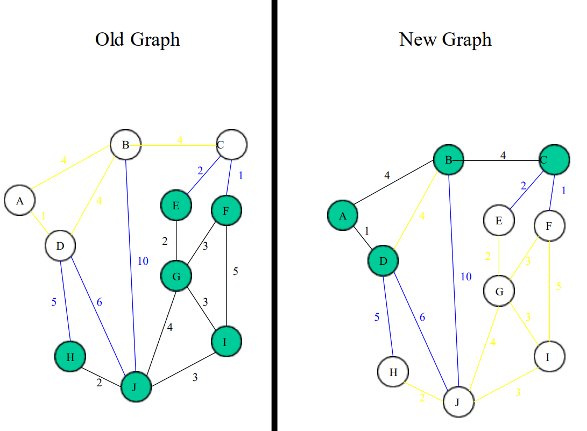
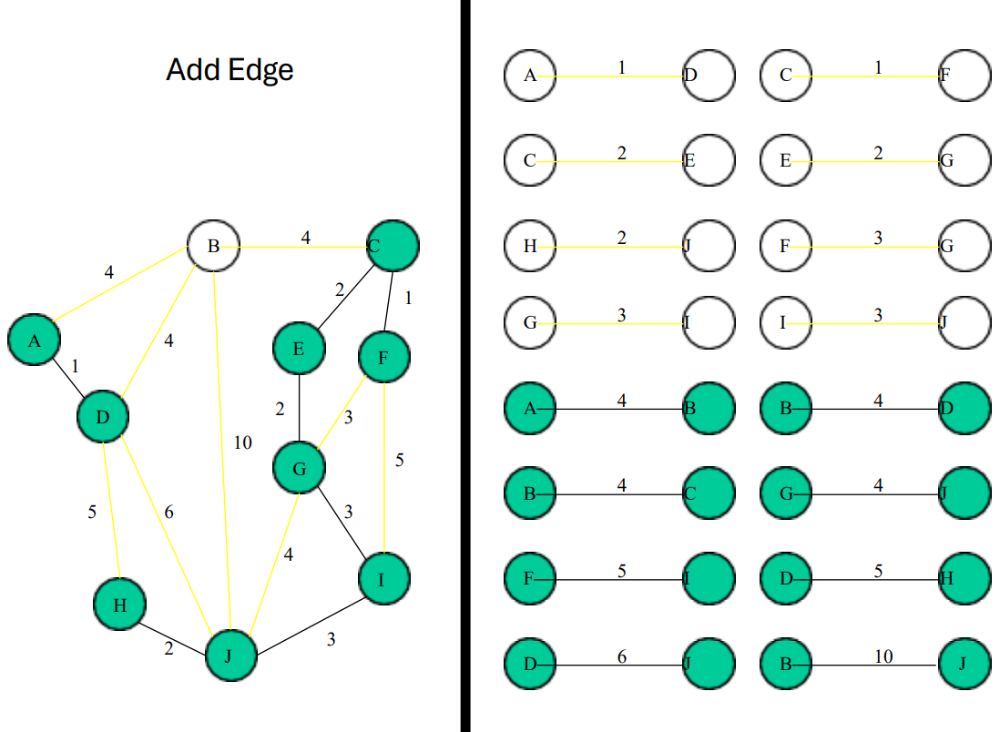

### DESIGN AND ANALYSIS OF ALGORITHMS - Lecture 1 Summary

---

### **Algorithm Definition**

* **Algorithm** : A finite sequence of instructions, each clear and executable in a finite time and effort.

### **Algorithm Criteria**

* **Input** : Zero or more externally supplied quantities.
* **Output** : At least one quantity produced.
* **Definiteness** : Instructions must be clear and unambiguous.
* **Finiteness** : The algorithm must terminate after a finite number of steps.
* **Effectiveness** : Instructions must be simple enough to carry out.

### **Algorithm Specification**

1. **Natural Language** : Written in plain language, e.g., English (requires clarity).
2. **Flowchart** : Graphical representation, useful for small/simple algorithms.
3. **Pseudo-code** : Combination of programming constructs and informal language.

### **Pseudo-code Conventions**

1. **Comments** : Begin with `//` and continue to the end of the line.
2. **Blocks** : Indicated with braces `{` and `}`.
3. **Identifiers** : Begin with a letter (data types not explicitly declared).
4. **Compound Data Types** : Example `Node` structure with fields like `data` and pointers.
5. **Assignment** : `<Variable> := <expression>`.
6. **Boolean Values** : `TRUE` and `FALSE` used with logical operators like AND, OR, NOT.
7. **Loops** :

* **While Loop** : `While <condition> do { <statements> }`.
* **For Loop** : `For variable := value1 to value2 step step do { <statements> }`.
* **Repeat-Until** : `repeat { <statements> } until <condition>`.

1. **Conditional Statements** :

* Simple: `If <condition> then <statement>`.
* With Else: `If <condition> then <statement1> Else <statement2>`.
* **Case Statement** : `Case { : <condition1>: <statement1> ... : else: <statement> }`.

1. **Input/Output** : `read` and `write` for input and output operations.
2. **Procedure** : `Algorithm <Name> (<Parameters>)`.

Here are some examples of pseudo-code programs demonstrating various concepts such as loops, conditionals, and functions:

##### **Example 1: Finding the Maximum of Two Numbers**

This example demonstrates a simple comparison to find the maximum of two numbers.

```plaintext
Algorithm MaxOfTwoNumbers(A, B)
    // A and B are two numbers
    If A > B then
        Return A
    Else
        Return B
```

##### **Example 2: Sum of First N Natural Numbers**

This example shows how to calculate the sum of the first `n` natural numbers using a loop.

```plaintext
Algorithm SumOfFirstNNumbers(n)
    // n is the number of natural numbers
    sum := 0
    For i := 1 to n do
        sum := sum + i
    EndFor
    Return sum
```

##### **Example 3: Factorial of a Number**

This program calculates the factorial of a given number `n` using a for loop.

```plaintext
Algorithm Factorial(n)
    // n is the number for which we need the factorial
    result := 1
    For i := 1 to n do
        result := result * i
    EndFor
    Return result
```

##### **Example 4: Fibonacci Sequence**

This program generates the first `n` terms of the Fibonacci sequence.

```plaintext
Algorithm Fibonacci(n)
    // n is the number of terms to generate
    a := 0
    b := 1
    Print a
    Print b
    For i := 3 to n do
        c := a + b
        Print c
        a := b
        b := c
    EndFor
```

##### **Example 5: Linear Search**

This example performs a linear search to find the index of an element in an array.

```plaintext
Algorithm LinearSearch(A, target)
    // A is the array and target is the element to search for
    For i := 1 to length of A do
        If A[i] == target then
            Return i
        EndIf
    EndFor
    Return -1 // Element not found
```

##### **Example 6: Bubble Sort**

This example demonstrates the Bubble Sort algorithm to sort an array in ascending order.

```plaintext
Algorithm BubbleSort(A)
    // A is the array to sort
    n := length of A
    For i := 1 to n-1 do
        For j := 1 to n-i do
            If A[j] > A[j+1] then
                // Swap A[j] and A[j+1]
                temp := A[j]
                A[j] := A[j+1]
                A[j+1] := temp
            EndIf
        EndFor
    EndFor
EndAlgorithm
```

##### **Example 7: Finding Prime Numbers (Sieve of Eratosthenes)**

This is an example of the Sieve of Eratosthenes algorithm to find all prime numbers up to `n`.

```plaintext
Algorithm SieveOfEratosthenes(n)
    // n is the upper limit for finding prime numbers
    Create a boolean array isPrime of size n+1
    For i := 2 to n do
        isPrime[i] := true
    EndFor

    For p := 2 to sqrt(n) do
        If isPrime[p] == true then
            For i := p^2 to n step p do
                isPrime[i] := false
            EndFor
        EndIf
    EndFor

    // Print all primes
    For i := 2 to n do
        If isPrime[i] == true then
            Print i
        EndIf
    EndFor
EndAlgorithm
```

##### **Example 8: Finding the GCD of Two Numbers (Euclidean Algorithm)**

This program computes the greatest common divisor (GCD) of two numbers using the Euclidean algorithm.

```plaintext
Algorithm GCD(a, b)
    // a and b are the two numbers
    While b != 0 do
        temp := b
        b := a mod b
        a := temp
    EndWhile
    Return a
EndAlgorithm
```

##### **Example 9: Binary Search**

This example demonstrates how to perform a binary search on a sorted array.

```plaintext
Algorithm BinarySearch(A, target)
    // A is the sorted array and target is the element to find
    low := 1
    high := length of A
    While low <= high do
        mid := (low + high) / 2
        If A[mid] == target then
            Return mid
        Else If A[mid] < target then
            low := mid + 1
        Else
            high := mid - 1
        EndIf
    EndWhile
    Return -1 // Element not found
EndAlgorithm
```

These are basic examples that showcase different algorithm types such as searching, sorting, mathematical operations, and generating sequences. They provide a clear way to represent algorithms using pseudo-code without being tied to any particular programming language syntax.

### **Performance Analysis**

* **Objective** : Analyze the memory and time needed for a program to run.
* **Two Approaches** : Analytical methods (theoretical) and experimental methods (empirical).
* **Key Terms** :
* **Time Complexity** : The time required by an algorithm as a function of problem size.
* **Space Complexity** : The memory required by a program.

### **Time Complexity**

* **Definition** : The time an algorithm takes, expressed as a function of the input size `f(n)`.
* **Asymptotic Complexity** : Behavior of the algorithm's time as input size increases.
* **Factors Affecting Running Time** :
* Input characteristics.
* Compiler efficiency.
* Machine characteristics.

### **Measuring Running Time**

* **Factors** :

1. Input data size.
2. Quality of code and compiler optimizations.
3. Machine specifications.

### **Space Complexity**

* **Definition** : The amount of memory required by an algorithm.
* **Components** :
* **Instruction Space** : Space for compiled instructions.
* **Data Space** : Space for constants, variables, and dynamically allocated objects.
* **Environment Stack** : Space for function calls and partial executions.

### **Complexity of Algorithms**

* **Definition** : A function `f(n)` that defines the running time/space requirement of an algorithm in terms of input size.
* **Storage Complexity** : Typically a multiple of data size.
* **Types of Complexity** :
* **Best Case** : Minimum value of `f(n)`.
* **Average Case** : Expected value of `f(n)`.
* **Worst Case** : Maximum value of `f(n)`.

### **Asymptotic Notations**

* **Big-O (O)** : Upper bound, indicates worst-case growth rate.
* **Big-Omega (Ω)** : Lower bound, indicates best-case growth rate.
* **Big-Theta (Θ)** : Exact bound, indicates when the growth rate is the same.

### **Time Complexities**

* **Common Notations** :
* `O(1)`, `O(log n)`, `O(n)`, `O(n log n)`, `O(n^2)`, `O(n^3)`, `O(2^n)`, `O(n!)`.
* **Classes** :
* **Constant** : Time does not depend on the size of input.
* **Logarithmic** : Time increases slowly as input grows (e.g., binary search).
* **Linear** : Time increases linearly with input size.
* **n log n** : Common in divide-and-conquer algorithms.
* **Quadratic (n²)** : Time increases quadratically (e.g., bubble sort).
* **Cubic (n³)** : Time increases cubically.
* **Exponential (2^n)** : Time doubles with each increase in input.

### **Classification of Algorithms**

| **Complexity** | **Description**                                      | **Example**              |
| -------------------- | ---------------------------------------------------------- | ------------------------------ |
| Constant             | Executed once or a few times                               | Search in an unordered list    |
| Logarithmic          | Slow growth of execution time as `n`increases            | Binary search                  |
| Linear               | Time increases linearly with `n`                         | Linear search                  |
| n log n              | Occurs in divide-and-conquer algorithms                    | Merge sort, Quick sort         |
| Quadratic (n²)      | Slow for large problems; practical only for small problems | Bubble sort, Insertion sort    |
| Cubic (n³)          | Slow for larger problems                                   | Triple nested loops            |
| Exponential          | Time doubles with each increase in input size              | Certain brute-force algorithms |

### **Numerical Comparison of Different Algorithms**

* For a given problem size `n`, execution time can be analyzed for different algorithms.
* Algorithms like O(n²) or O(2^n) become impractical as input size grows due to excessive time complexity.

---

This summary encapsulates the key points from the lecture on  **Design and Analysis of Algorithms** . It outlines algorithm definition, criteria, pseudo-code conventions, performance analysis, and different complexities with examples.

# lecture 2 : Graphs

## What Are Graphs in Data Structure?

A graph is a non-linear kind of data structure made up of nodes or vertices and edges. The edges connect any two nodes in the graph, and the nodes are also known as vertices.


This graph has a set of vertices V= { 1,2,3,4,5} and a set of edges E= { (1,2),(1,3),(2,3),(2,4),(2,5),(3,5),(4,50 }.

Now that you’ve learned about the definition of graphs in data structures, you will learn about their various types.

## Types of Graphs in Data Structures

There are different types of graphs in data structures, each of which is detailed below.

### 1. Finite Graph

The graph G=(V, E) is called a finite graph if the number of vertices and edges in the graph is limited in number


### 2. Infinite Graph

The graph G=(V, E) is called a finite graph if the number of vertices and edges in the graph is interminable.


### 3. Trivial Graph

A graph G= (V, E) is trivial if it contains only a single vertex and no edges.


### 4. Simple Graph

If each pair of nodes or vertices in a graph G=(V, E) has only one edge, it is a simple graph. As a result, there is just one edge linking two vertices, depicting one-to-one interactions between two elements.


### 5. Multi Graph

If there are numerous edges between a pair of vertices in a graph G= (V, E), the graph is referred to as a multigraph. There are no self-loops in a Multigraph.


### 6. Null Graph

It's a reworked version of a trivial graph. If several vertices but no edges connect them, a graph G= (V, E) is a null graph.


### 7. Complete Graph

If a graph G= (V, E) is also a simple graph, it is complete. Using the edges, with n number of vertices must be connected. It's also known as a full graph because each vertex's degree must be n-1.


### 8. Pseudo Graph

If a graph G= (V, E) contains a self-loop besides other edges, it is a pseudograph.


### 9. Regular Graph

If a graph G= (V, E) is a simple graph with the same degree at each vertex, it is a regular graph. As a result, every whole graph is a regular graph.


### 10. Weighted Graph

A graph G= (V, E) is called a labeled or weighted graph because each edge has a value or weight representing the cost of traversing that edge.


### 11. Directed Graph

A directed graph also referred to as a digraph, is a set of nodes connected by edges, each with a direction.


### 12. Undirected Graph

An undirected graph comprises a set of nodes and links connecting them. The order of the two connected vertices is irrelevant and has no direction. You can form an undirected graph with a finite number of vertices and edges.


### 13. Connected Graph

If there is a path between one vertex of a graph data structure and any other vertex, the graph is connected.


### 14. Disconnected Graph

When there is no edge linking the vertices, you refer to the null graph as a disconnected graph.


### 15. Cyclic Graph

If a graph contains at least one graph cycle, it is considered to be cyclic.


### 16. Acyclic Graph

When there are no cycles in a graph, it is called an acyclic graph.


### 17. Directed Acyclic Graph

It's also known as a directed acyclic graph (DAG), and it's a graph with directed edges but no cycle. It represents the edges using an ordered pair of vertices since it directs the vertices and stores some data.


### 18. Subgraph

The vertices and edges of a graph that are subsets of another graph are known as a subgraph.


After you learn about the many types of graphs in graphs in data structures, you will move on to graph terminologies.

## Terminologies of Graphs in Data Structures

Following are the basic terminologies of graphs in data structures:

* An edge is one of the two primary units used to form graphs. Each edge has two ends, which are vertices to which it is attached.
* If two vertices are endpoints of the same edge, they are adjacent.
* A vertex's outgoing edges are directed edges that point to the origin.
* A vertex's incoming edges are directed edges that point to the vertex's destination.
* The total number of edges occurring to a vertex in a graph is its degree.
* The out-degree of a vertex in a directed graph is the total number of outgoing edges, whereas the in-degree is the total number of incoming edges.
* A vertex with an in-degree of zero is referred to as a source vertex, while one with an out-degree of zero is known as sink vertex.
* An isolated vertex is a zero-degree vertex that is not an edge's endpoint.
* A path is a set of alternating vertices and edges, with each vertex connected by an edge.
* The path that starts and finishes at the same vertex is known as a cycle.
* A path with unique vertices is called a simple path.
* For each pair of vertices x, y, a graph is strongly connected if it contains a directed path from x to y and a directed path from y to x.
* A directed graph is weakly connected if all of its directed edges are replaced with undirected edges, resulting in a connected graph. A weakly linked graph's vertices have at least one out-degree or in-degree.
* A tree is a connected forest. The primary form of the tree is called a rooted tree, which is a free tree.
* A spanning subgraph that is also a tree is known as a [spanning tree.](https://www.simplilearn.com/tutorials/data-structure-tutorial/spanning-tree-in-data-structure "spanning tree.")
* A connected component is the unconnected graph's most connected subgraph.
* A bridge, which is an edge of removal, would sever the graph.
* Forest is a graph without a cycle.

Following that, you will look at the graph representation in this data structures tutorial.

## Representation of Graphs in Data Structures

Graphs in data structures are used to represent the relationships between objects. Every graph consists of a set of points known as vertices or nodes connected by lines known as edges. The vertices in a network represent entities.

The most frequent graph representations are the two that follow:

* Adjacency matrix
* Adjacency list

You’ll look at these two representations of graphs in data structures in more detail:

### Adjacency Matrix

* A sequential representation is an adjacency matrix.
* It's used to show which nodes are next to one another. I.e., is there any connection between nodes in a graph?
* You create an MXM matrix G for this representation. If an edge exists between vertex a and vertex b, the corresponding element of G, gi,j = 1, otherwise gi,j = 0.
* If there is a weighted graph, you can record the edge's weight instead of 1s and 0s.

#### Undirected Graph Representation


#### Directed Graph Representation


#### Weighted Undirected Graph Representation

Weight or cost is indicated at the graph's edge, a weighted graph representing these values in the matrix.


### Adjacency List

* A linked representation is an adjacency list.
* You keep a list of neighbors for each vertex in the graph in this representation. It means that each vertex in the graph has a list of its neighboring vertices.
* You have an arra[](https://www.simplilearn.com/tutorials/data-structure-tutorial/arrays-in-data-structure "array") of vertices indexed by the vertex number, and the corresponding [array](https://www.simplilearn.com/tutorials/data-structure-tutorial/arrays-in-data-structure "array") member for each vertex x points to a [singly linked list](https://www.simplilearn.com/tutorials/data-structure-tutorial/singly-linked-list "singly linked list") of x's neighbors.

#### Weighted Undirected Graph Representation Using Linked-List


#### Weighted Undirected Graph Representation Using an Array


You will now see which all operations are conducted in graphs data structure after understanding the representation of graphs in the data structure.

**Also Read: [Linked List in A Data Structure](https://www.simplilearn.com/tutorials/data-structure-tutorial/linked-list-in-data-structure "Linked List in A Data Structure")**

## Operations on Graphs in Data Structures

The operations you perform on the graphs in data structures are listed below:

* Creating graphs
* Insert vertex
* Delete vertex
* Insert edge
* Delete edge

You will go over each operation in detail one by one:

### Creating Graphs

There are two techniques to make a graph:

#### 1. Adjacency Matrix

The adjacency matrix of a simple labeled graph, also known as the connection matrix, is a matrix with rows and columns labeled by graph vertices and a 1 or 0 in position depending on whether they are adjacent or not.

#### 2. Adjacency List

A finite graph is represented by an adjacency list, which is a collection of unordered lists. Each unordered list describes the set of neighbors of a particular vertex in the graph within an adjacency list.

### Insert Vertex

When you add a vertex that after introducing one or more vertices or nodes, the graph's size grows by one, increasing the matrix's size by one at the row and column levels.


### Delete Vertex

* Deleting a vertex refers to removing a specific node or vertex from a graph that has been saved.
* If a removed node appears in the graph, the matrix returns that node. If a deleted node does not appear in the graph, the matrix returns the node not available.


### Insert Edge

Connecting two provided vertices can be used to add an edge to a graph.


### Delete Edge

The connection between the vertices or nodes can be removed to delete an edge.


The types of graph traversal algorithms will be discussed next in the graphs in this data structures tutorial.

## Graph Traversal Algorithm

The process of visiting or updating each vertex in a graph is known as graph traversal. The sequence in which they visit the vertices is used to classify such traversals. Graph traversal is a subset of tree traversal.

There are two techniques to implement a graph traversal algorithm:

* Breadth-first search
* Depth-first search

### Breadth-First Search or BFS

[BFS](https://www.simplilearn.com/tutorials/data-structure-tutorial/bfs-algorithm "BFS") is a search technique for finding a node in a graph data structure that meets a set of criteria.

* It begins at the root of the graph and investigates all nodes at the current depth level before moving on to nodes at the next depth level.
* To maintain track of the child nodes that have been encountered but not yet inspected, more memory, generally you require a [queue.](https://www.simplilearn.com/tutorials/data-structure-tutorial/queue-in-data-structure "queue.")

Algorithm of breadth-first search

Step 1: Consider the graph you want to navigate.

Step 2: Select any vertex in your graph, say v1, from which you want to traverse the graph.

Step 3: Examine any two data structures for traversing the graph.

* Visited array (size of the graph)
* Queue data structure

Step 4: Starting from the vertex, you will add to the visited array, and afterward, you will v1's adjacent vertices to the queue data structure.

Step 5: Now, using the FIFO concept, you must remove the element from the queue, put it into the visited array, and then return to the queue to add the adjacent vertices of the removed element.

Step 6: Repeat step 5 until the queue is not empty and no vertex is left to be visited.


### Depth-First Search or DFS

[DFS](https://www.simplilearn.com/tutorials/data-structure-tutorial/dfs-algorithm "DFS") is a search technique for finding a node in a graph data structure that meets a set of criteria.

* The depth-first search (DFS) algorithm traverses or explores data structures such as trees and graphs. The DFS algorithm begins at the root node and examines each branch as far as feasible before backtracking.
* To maintain track of the child nodes that have been encountered but not yet inspected, more memory, [generally a stack](https://www.simplilearn.com/tutorials/data-structure-tutorial/stacks-in-data-structures "generally a stack"), is required.

Algorithm of depth-first search

Step 1: Consider the graph you want to navigate.

Step 2: Select any vertex in our graph, say v1, from which you want to begin traversing the graph.

Step 3: Examine any two data structures for traversing the graph.

* Visited array (size of the graph)
* Stack data structure

Step 4: Insert v1 into the array's first block and push all the adjacent nodes or vertices of vertex v1 into the stack.

Step 5: Now, using the FIFO principle, pop the topmost element and put it into the visited array, pushing all of the popped element's nearby nodes into it.

Step 6: If the topmost element of the stack is already present in the array, discard it instead of inserting it into the visited array.

Step 7: Repeat step 6 until the stack data structure isn't empty.


You will now look at applications of graph data structures after understanding the graph traversal algorithm in this tutorial.

## Application of Graphs in Data Structures

Following  are some applications of graphs in data structures:

* Graphs are used in computer science to depict the flow of computation.
* Users on Facebook are referred to as vertices, and if they are friends, there is an edge connecting them. The Friend Suggestion system on Facebook is based on graph theory.
* You come across the Resource Allocation Graph in the Operating System, where each process and resource are regarded vertically. Edges are drawn from resources to assigned functions or from the requesting process to the desired resource. A stalemate will develop if this results in the establishment of a cycle.
* Web pages are referred to as vertices on the World Wide Web. Suppose there is a link from page A to page B that can represent an edge. This application is an illustration of a directed graph.
* Graph transformation systems manipulate graphs in memory using rules. Graph databases store and query graph-structured data in a transaction-safe, permanent manner.

# What Is Spanning Tree

Did you know that in a Local Area Network, the spanning tree data structure is applied to manage routing systems? Additionally, it is also used to implement telecommunication networks, transportation networks, and electrical grids as it provides an optimal implementation path. So, in this article, we will discover what a spanning tree in [data structure](https://www.simplilearn.com/tutorials/data-structure-tutorial/what-is-data-structure "data structure") is and understand its functionalities and applications.

## Graphs and Their Different Types

Spanning tree in data structures and [algorithms](https://www.simplilearn.com/tutorials/data-structure-tutorial/what-is-an-algorithm "algorithms") is developed by referencing the mathematical field of graph theory. Thus, primarily, we shall understand a few terminologies about the graph at a glance.

A graph is a structure that contains vertices and edges connecting them. Based on their edge connectivity, there are three basic types of graphs as follows:

* ### Undirected Graph

The graph in which all the edges don’t point to any specific direction is called an undirected graph. Since there is no particular direction given for traversal, this graph’s edges are considered bidirectional. The representation of the graph shown below is an example of an undirected graph.


* ### Directed Graph

The graph in which all the edges point to only one specific direction is called a directed graph. In this type of graph, the retrieval to the last node is not possible since the edges of this graph can only be traversed in one direction.


In the diagram shown above, you can clearly observe that the traversal is possible from direction A -> E.However, you cannot retrieve back at position A from node E due to the directions of edges.

* ### Connected Graph

A connected graph is a graph in which there is a path from one vertex to any other vertex in a graph. According to this definition, null graphs and singleton graphs can also be called connected graphs. The graph shown below is a connected graph, as you can visit any vertex from any other vertex of a graph.


## Introduction to Spanning Tree

If you have graph G with vertices V and edges E, then that graph can be represented as G(V, E). For this graph G(V, E), if you construct a tree structure G’(V’, E’) such that the formed tree structure follows constraints mentioned below, then that structure can be called a Spanning Tree.

1. V’ = V   (number of Vertices in G’ must be equal to the number of vertices in G)
2. E’ = |V| - 1   (Edges of G’ must be equal to the number of vertices in graph G minus 1)

Let’s understand this by creating spanning trees for a particular graph structure.

## Creating Spanning Trees for Given Graph

Let’s assume that you want to create the spanning tree structures for the graph given below:


As mentioned earlier, the spanning tree has the same number of vertices as the graph. In this case, you have a total number of vertices in the graph equal to 5. Thus, T(V’, E’) will also have 5 vertices in its structure. Additionally,  the number of edges E’ must be equal to the number of vertices in the graph minus one, i.e., 4. For this given graph, five spanning trees can be constructed as shown below:


## How to Calculate the Number of Possible Spanning Trees

A connected graph can have several spanning trees, as previously stated. So, how do you estimate how many distinct spanning trees can be created for a given graph? Graph theory in mathematics provides the answer to this question. According to graph theory, in order to determine the number of feasible spanning trees, you must first determine the graph's type.

If a given graph formulates a closed cycle and has the number of vertices equal to the number of edges, then that graph can be called a cycle graph. And the number of possible spanning trees for any cycle graph is equal to the number of its vertices or edges. The graph for which we created the spanning trees previously had 5 vertices and 5 edges with a closed cycle.

Thus, n(ST)cycle graph =V =E =5

Otherwise, if a unique edge connects each pair of vertices in a graph, it will be considered as a complete graph. And the number of possible spanning trees for this complete graph can be calculated using Cayley’s Formula:

 n(ST)complete graph =V(v-2)

The graph given below is an example of a complete graph consisting of 4 vertices and 6 edges. For this graph, number of possible spanning trees will be:


 n(ST)cg =V(v-2)=4(4-2)=42=16

## Properties of Spanning Tree

In parallel and distributed computing, spanning trees are crucial. Listed below are a few important properties of spanning trees.

* A spanning tree whose overall resultant weight value is minimal is considered to be a Minimal Spanning Tree.
* A connected graph can have more than one spanning tree.
* All Spanning trees must contain the same number of vertices as of graph, and the number of edges must be equal to |V| - 1.
* The spanning tree must not contain any cycle.
* If the given graph is a cycle graph, then the number of possible spanning trees will be equal to the number of vertices of the given graph.
* If the given graph is a complete graph, then the number of possible spanning trees can be calculated using Cayley’s Formula.
* A spanning tree cannot be disconnected. If you remove any edge from the created tree, then it won’t be considered as a spanning tree anymore. It can only be regarded as a disconnected graph. The diagram given below explains the same:


* There is a chance that there will be more than one minimum spanning tree if there are numerous edges with the same weight.

Consider the example given below. The graph shown here has 4 vertices and 4 edges. And two edges of this graph have the same weight values as the remaining two. Thus, the possible spanning trees for this graph will be more than one with the exact cost.


## Applications of Spanning Tree

The following are the applications of the spanning trees:

* Telecommunication Network Building: If we want to develop a telecommunication network for the entire city, a basic naive approach will be more expensive. We can create a communications system at a lower cost by using the Minimum Spanning Tree technique. The image given below explains the difference between Naive and MST routing.


* Constructing Highways or Railroads: For constructing highways or railroads the Minimum Spanning Tree approach is utilized everywhere. Given the possible routes between two cities, MST technique provides you with the optimal route. Basically, the algorithm treats the cities as the vertices and paths joining them as edges to create a subtree that will make the route fully connected and cost efficient.


* Image Segmentation: During picture segmentation, a spanning tree is utilized to construct tiles of comparable pixels. The pixels which seem closer to each other and have the same color type are grouped together. This technique is used in every aspect of computer vision in machine learning.


## Conclusion

In this tutorial, we explored Spanning Tree in a data structure. We discussed various properties of spanning trees and learned how to create these trees for a given graph topology. Later, in this tutorial, we also learned about the applications of spanning trees in order to comprehend its significance.


# Minimum Spanning Tree

Did you know that the MST (Minimum Spanning Tree) Protocol in networking is designed using a minimum spanning tree algorithm in [data structure](https://www.simplilearn.com/tutorials/data-structure-tutorial/what-is-data-structure "data structure")? The MSTP provides simple yet fully connected routing paths for any bridged local area network. Additionally, it also makes sure that the network loop never gets created in the system. So, in this article, we will learn about the minimum spanning tree in data structures, as well as its functions and applications.


## Introduction to Minimum Spanning Tree

The minimum spanning tree algorithm is developed by referencing the field of graph theory in mathematics. Thus, [to understand this algorithm](https://www.simplilearn.com/data-structures-and-algorithms-article "to understand this algorithm"), we shall first understand what a spanning tree is?

A spanning tree of a connected undirected graph is a subgraph, i.e., a tree structure that binds all vertices with a minimum edge cost sum. If you have graph G with vertices V and edges E, then that graph can be represented as G(V, E). For this graph G(V, E), if you construct a tree structure G’(V’, E’) such that the formed tree structure follows constraints mentioned below, then that structure can be called a Spanning Tree.

1. V’ = V   (number of Vertices in G’ must be equal to the number of vertices in G)
2. E’ = |V| - 1   (Edges of G’ must be equal to the number of vertices in graph G minus 1)

Let's create spanning trees for a given graph topology to understand this concept better.


For the graph above, possible spanning tree structures are:


Now, let’s look at the sum of edge weight costs for all these [spanning trees](https://www.simplilearn.com/tutorials/data-structure-tutorial/spanning-tree-in-data-structure "spanning trees") represented in the table below:

| Spanning Tree | Sum of Edge Costs |
| ------------- | ----------------- |
| ST - 1        | 22                |
| ST - 2        | 35                |
| ST - 3        | 36                |

Table - 1: Sum of Edge costs

The spanning tree structure 1 has an overall edge weight cost of 22. Which is the least possible substructure cost for given graph G. Thus, ST-1 is considered the minimum spanning tree of graph G. A minimum spanning tree in a weighted graph is one that has the least weight of all the other spanning tree structures.


## How to Find the Minimum Spanning Tree?

The naive method we discussed above is not an ideal approach to find out possible MST structures. In that method, we will have to generate all possible spanning trees at first and then calculate the overall sum of edge weights for each generated spanning tree. After that, we will have to determine the minima of all those spanning trees, which will cost us more time and memory.

A better method is to locate a vital attribute of the MST, which will provide clarification if some particular edge should be included in it or not. And then, we can use that property to build up the MST gradually. Let’s find out how we can do that with the help of the greedy programming paradigm. The greedy algorithms that we can use are Prim’s Algorithm and Kruskal’s Algorithm.

First, we shall look into Prim’s algorithm.

### 1. Prim’s Algorithm

[Prim&#39;s algorithm begins with a single node](https://www.simplilearn.com/tutorials/data-structure-tutorial/prims-algorithm "Prim's algorithm begins with a single node") and adds up adjacent nodes one by one by discovering all of the connected edges along the way. Edges with the lowest weights that don't generate cycles are chosen for inclusion in the MST structure. As a result, we can claim that Prim's algorithm finds the globally best answer by making locally optimal decisions.


* This algorithm starts with one node.
* It then, one by one, adds a node that is unconnected to the new graph to the new graph, each time selecting the node whose
  connecting edge has the smallest weight out of the available nodes’ connecting edges.

Steps involved in Prim’s algorithms are mentioned below:

1. Select any vertex.
2. Select the shortest edge connected to that vertex.
3. Select the shortest edge connected to any vertex already
   connected.
4. Repeat step 3 until all vertices have been connected.

Every step will have joined one node, so that at the end we will have
one graph with all the nodes and it will be a minimum spanning tree of
the original graph.





#### Analysis of Prim's Algorithm

Running Time = O(m + n log n) (m = edges, n = nodes) If a heap is not used, the run time will be O(n^2) instead of O(m + n log n). However, using a heap complicates the code since you’re complicating the data structure. A Fibonacci heap is the best kind
of heap to use, but again, it complicates the code.

Unlike Kruskal’s, it doesn’t need to see all of the graph at once. It can deal with it one piece at a time. It also doesn’t need to worry if adding an edge will create a cycle since this algorithm deals primarily with the nodes, and not the edges.

For this algorithm the number of nodes needs to be kept to a minimum in addition to the number of edges. For small graphs, the edges matter more, while for large graphs the number of nodes matters more.

### 2. Kruskal’s Algorithm

Kruskal's approach sorts all the edges in ascending order of edge weights and only adds nodes to the tree if the chosen edge does not form a cycle. It also selects the edge with the lowest cost first and the edge with the highest cost last. As a result, we can say that the [Kruskal algorithm](https://www.simplilearn.com/tutorials/data-structure-tutorial/kruskal-algorithm "Kruskal algorithm") makes a locally optimum decision in the hopes of finding the global optimal solution. Hence, this algorithm can also be considered as a [Greedy Algorithm.](https://www.simplilearn.com/tutorials/data-structure-tutorial/greedy-algorithm "Greedy Algorithm.")

This algorithm creates a forest of trees.
• Initially the forest consists of n single node trees (and no edges).
• At each step, we add one edge (the cheapest one) so that it joins two trees together repeatedly without forming a cycle

The steps are:

1. Select the shortest edge in a network.
2. Select the next shortest edge which does not create a circle.
3. Repeat step 2 until all vertices have been connected.

Every step will have joined two trees in the forest together, so that at
the end, there will only be one tree in T.

Complete Graph


step 1 extract all edges


step 2 Sort edges


Add edges: In order of weight


Do not add the Cycle





## Analysis of Kruskal'sAlgorithm

Running Time = O(m log n) (m = edges, n = nodes)
Testing if an edge creates a cycle can be slow unless a complicated data structure called a “union-find” structure is used. It usually only has to check a small fraction of the edges, but in some cases (like if there was a vertex connected to the graph by only one edge and it was the longest edge) it would have to check all the edges.
This algorithm works best, of course, if the number of edges is kept to a minimum.
